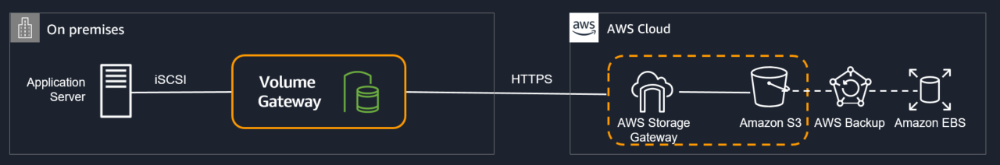

## AWS Solutions Architect – Associate SAA-C02 Exam Topics
## 考试大纲
### Networking
- Be sure to create VPC from scratch. This is mandatory.
  - Create VPC and understand whats an CIDR and addressing patterns
  - Create public and private subnets, configure proper routes, security groups, NACLs. (*hint: Subnets are public or private depending on whether they can route traffic directly through Internet gateway*)
  - Create Bastion for communication with instances
  - Create NAT Gateway or Instances for instances in private subnets to interact with internet
  - Create two tier architecture with application in public and database in private subnets
  - Create three tier architecture with web servers in public, application and database servers in private. (hint: focus on security group configuration with least privilege)
  - Make sure to understand how the communication happens between Internet, Public subnets, Private subnets, NAT, Bastion etc.
- Understand difference between Security Groups and NACLs (hint: Security Groups are Stateful vs NACLs are stateless. Also only NACLs provide an ability to deny or block IPs)
- Understand VPC endpoints and what services it can help interact (hint: VPC Endpoints routes traffic internally without Internet)
  - VPC Gateway Endpoints supports S3 and DynamoDB.
  - VPC Interface Endpoints OR Private Links supports others
- Understand difference between NAT Gateway and NAT Instance (hint: NAT Gateway is AWS managed and is scalable and highly available)
- Understand how NAT high availability can be achieved (hint: provision NAT in each AZ and route traffic from subnets within that AZ through that NAT Gateway)
- Understand VPN and Direct Connect for on-premises to AWS connectivity
  - VPN provides quick connectivity, cost-effective, secure channel, however routes through internet and does not provide consistent throughput
  - Direct Connect provides consistent dedicated throughput without Internet, however requires time to setup and is not cost-effective
- Understand Data Migration techniques
  - Choose Snowball vs Snowmobile vs Direct Connect vs VPN depending on the bandwidth available, data transfer needed, time available, encryption requirement, one-time or continuous requirement
  - Snowball, SnowMobile are for one-time data, cost-effective, quick and ideal for huge data transfer
  - Direct Connect, VPN are ideal for continuous or frequent data transfers
- Understand CloudFront as CDN and the static and dynamic caching it provides, what can be its origin (hint: CloudFront can point to on-premises sources and its usecases with S3 to reduce load and cost)
- Understand Route 53 for routing
  - Understand Route 53 health checks and failover routing
  - Understand  Route 53 Routing Policies it provides and their use cases mainly for high availability (hint: focus on weighted, latency, geolocation, failover routing)
- Be sure to cover ELB concepts in deep.
  - SAA-C02 focuses on ALB and NLB and does not cover CLB
  - Understand differences between  CLB vs ALB vs NLB
    - ALB is layer 7 while NLB is layer 4
    - ALB provides content based, host based, path based routing
    - ALB provides dynamic port mapping which allows same tasks to be hosted on ECS node
    - NLB provides low latency and ability to scale
    - NLB provides static IP address
### Security
- Understand IAM as a whole
  - Focus on IAM role (hint: can be used for EC2 application access and Cross-account access)
  - Understand IAM identity providers and federation and use cases
  - Understand MFA and how would implement two factor authentication for an application
  - Understand IAM Policies (hint: expect couple of questions with policies defined and you need to select correct statements)
- Understand encryption services
  - KMS for key management and envelope encryption
  - Focus on S3 with SSE, SSE-C, SSE-KMS
  - Know SQS now provides SSE support 
- AWS WAF integrates with CloudFront to provide protection against Cross-site scripting (XSS) attacks. It also provide IP blocking and geo-protection.
- AWS Shield integrates with CloudFront to provide protection against DDoS.
- Refer Disaster Recovery whitepaper, be sure you know the different recovery types with impact on RTO/RPO.
### Storage
- Understand various storage options S3, EBS, Instance store, EFS, Glacier, FSx and what are the use cases and anti patterns for each
- Instance Store
  - Understand Instance Store (hint: it is physically attached  to the EC2 instance and provides the lowest latency and highest IOPS)
- Elastic Block Storage – EBS
  - Understand various EBS volume types and their use cases in terms of IOPS and throughput. SSD for IOPS and HDD for throughput
  - Understand Burst performance and I/O credits to handle occasional peaks
  - Understand EBS Snapshots (hint: backups are automated, snapshots are manual) 
- Simple Storage Service – S3
  - Cover S3 in depth
  - Understand S3 storage classes with lifecycle policies
  - Understand the difference between SA Standard vs SA IA vs SA IA One Zone in terms of cost and durability
  - Understand S3 Data Protection (hint: S3 Client side encryption encrypts data before storing it in S3)
  - Understand S3 features including
    - S3 provides a cost effective static website hosting
    - S3 versioning provides protection against accidental overwrites and deletions
    - S3 Pre-Signed URLs for both upload and download provides access without needing AWS credentials
    - S3 CORS allows cross domain calls
    - S3 Transfer Acceleration enables fast, easy, and secure transfers of files over long distances between your client and an S3 bucket.
  - Understand Glacier as an archival storage with various retrieval patterns
  - Glacier Expedited retrieval now allows object retrieval within mins
- Understand Storage gateway and its different types.
  - Cached Volume Gateway provides access to frequently accessed data, while using AWS as the actual storage
  - Stored Volume gateway uses AWS as a backup, while the data is being stored on-premises as well
  - File Gateway supports SMB protocol
- Understand FSx easy and cost effective to launch and run popular file systems.
  - FSx provides two file systems to choose from: Amazon FSx for Windows File Server for business applications and Amazon FSx for Lustre for high-performance workloads.
- Understand the difference between EBS vs S3 vs EFS
  - EFS provides shared volume across multiple EC2 instances, while EBS can be attached to a single volume within the same AZ.
- Understand the difference between EBS vs Instance Store
- Would recommend referring Storage Options whitepaper, although a bit dated 90% still holds right
### Compute
- Understand Elastic Cloud Compute – EC2
- Understand Auto Scaling and ELB, how they work together to provide High Available and Scalable solution. (hint: Span both ELB and Auto Scaling across Multi-AZs to provide High Availability)
- Understand EC2 Instance Purchase Types – Reserved, Scheduled Reserved, On-demand and Spot and their use cases
  - Choose Reserved Instances for continuous persistent load
  - Choose Scheduled Reserved Instances for load with fixed scheduled and time interval
  - Choose Spot instances for fault tolerant and Spiky loads
  - Reserved instances provides cost benefits for long terms requirements over On-demand instances
  - Spot instances provides cost benefits for temporary fault tolerant spiky load
- Understand EC2 Placement Groups (hint: Cluster placement groups provide low latency and high throughput communication, while Spread placement group provides high availability)
- Understand Lambda and serverless architecture, its features and use cases. (hint: Lambda integrated with API Gateway to provide a serverless, highly scalable, cost-effective architecture)
- Understand ECS with its ability to deploy containers and micro services architecture.
  - ECS role for tasks can be provided through taskRoleArn
  - ALB provides dynamic port mapping to allow multiple same tasks on the same node
- Know Elastic Beanstalk at a high level, what it provides and its ability to get an application running quickly.
### Databases
- Understand relational and NoSQLs data storage options which include RDS, DynamoDB, Aurora and their use cases
- RDS
  - Understand RDS features – Read Replicas vs Multi-AZ
    - Read Replicas for scalability, Multi-AZ for High Availability
    - Multi-AZ are regional only
    - Read Replicas can span across regions and can be used for disaster recovery
  - Understand Automated Backups, underlying volume types
- Aurora
  - Understand Aurora
    - provides multiple read replicas and replicates 6 copies of data across AZs
  - Understand Aurora Serverless provides a highly scalable cost-effective database solution
- DynamoDB
  - Understand DynamoDB with its low latency performance, key-value store (hint: DynamoDB is not a relational database)
  - DynamoDB DAX provides caching for DynamoDB
  - Understand DynamoDB provisioned throughput for Read/Writes (It is more cover in Developer exam though.)
- Know ElastiCache use cases, mainly for caching performance
### Integration Tools
- Understand SQS as message queuing service and SNS as pub/sub notification service
- Understand SQS features like visibility, long poll vs short poll
- Focus on SQS as a decoupling service
- Understand SQS Standard vs SQS FIFO difference (hint: FIFO provides exactly once delivery both low throughput)
### Analytics
- Know Redshift as a business intelligence tool
- Know Kinesis for real time data capture and analytics
- Atleast know what AWS Glue does, so you can eliminate the answer
### Management Tools
- Understand CloudWatch monitoring to provide operational transparency
- Know which EC2 metrics it can track. Remember, it cannot track memory and disk space/swap utilization
- Understand CloudWatch is extendable with custom metrics
- Understand CloudTrail for Audit
- Have a basic understanding of CloudFormation, OpsWorks
<hr/>

https://www.jianshu.com/p/56fa483e01bc?utm_campaign=hugo
https://zhenye-na.github.io/aws-certs-cheatsheet
## AWS Region & Availability Zone
### Region
> A region is a geographical area. Each Region consists of 2 or more Availability Zone.

> region 是一个地理上的区域，每个region包含 2至多个 AZ

### Availability Zone
> An Availability Zone may be several Data Centers. If they (Data Centers) are close to each other, they may be counted as one Availability Zone.

> AZ 是一个或多个数据中心，如果数据中心距离较近会算作一个 AZ

### Edge Locations
> Edge Locations are endpoints for AWS which are used for caching content. Typically, this consists of CloudFront, Amazon’s Content Delivery Network.


### Exam Tips
1. A **Region** is a physical location in the world, which consists of two or more Availability Zones.
2. An **Availability Zone** is one or more discrete Data Centers, each with redundant power, networking, and connectivity, housed in a separate facility.
3. **Edge Locations** are the endpoints for AWS which are used for caching content. Typically, this consists of CloudFront, Amazon’s Content Delivery Network.

# Identity Access Management (IAM)
- IAM allows you to manage users, groups, roles, permissions (level of access) to the AWS console
IAM has a global view, not need to choose a Region

### IAM Features
IAM offers the following features:
1. Centralized control of your AWS account
2. Shared Access to your AWS account
3. Granular Permissions
4. Identity Federation (Active Directory, Github …)
5. Multi-Factor Authentication
6. Provide temporary access for users/devices and services where necessary
7. Allows you to set up your password rotation policy
8. integrates with many different AWS services
9. Support PCI DSS Compliance

### Terminology of IAM
> Users(a physicial person)<br>
> Groups(grant to users) <br>
> Roles (grant to a mechine or a AWS service)<br>
> Policies (a JSON formatted file, call Policy Document)

### IAM - Advanced
**AWS STS - Security Token Service**
- Allows granting limited and temporary access to AWS resources
- Token is valid for up to one hour (must be refreshed)
```
AssumeRole
AssumeRoleWithSAML
AssumeRoleWithWebIdentity
GetSessionToken
```
**Using STS to Assume a Role**
- Define an IAM Role within your account or cross-account
- Define which principals can access this IAM Role
- Use AWS STS to retrieve credentials and impersonate the IAM Role you have access to (AssumeRole API)
- Temporary credentials can be valid between 15 minutes to 1 hour
> 创建 IAM role并设置 role 的权限， 设置谁能通过 STS 获取 role，通过STS 相关 API 获取 role， 每个 STS 凭证可以保持最多 1 小时就要刷新


### Directory Services
- AWS Managed Microsoft AD
    - Create your AD in AWS, manage users locally, supports MFA
    - Establish trust connections with your on-premise AD
- AD Connector
    - Directory Gateway (proxy) to redirect to on-premise AD
    - Users are managed on the on-premise AD
- Simple AD
    - AD-compatible managed directory on AWS
    - Cannot be joined with on-premise AD

### AWS Organizations
- Global service
- Allows managing multiple AWS accounts
- The main account is the master account (cannot change this)
- Other accounts are member accounts
- Member accounts can only be part of one organization
- Consolidated billing across all accounts - one payment method
- API is available to automate AWS account creation

**Organization Units (OU)**

### Service Control Policies (SCP)
- SCP contains Allowlist or denylist IAM actions and can be applied at the Root, OU, or Account level
- SCP is applied to all the Users and Roles of the Account, including Root
The SCP does not affect service-linked roles
service-linked roles enable other AWS services to integrate with AWS Organizations and cannot be restricted by SCPs
- SCP must have an explicit Allow rule (since it does not allow anything by default)
> SCP 基于服务的控制策略，SCP 包含一个可以(或禁止)操作的服务和资源列表，可以分配给各个层级的 account。<br>
> SCP 不能影响与服务关联的 role(service-linked roles)<br>
> SCP 必须指定允许什么，因为默认它什么都不允许做

### IAM Roles vs Resource-Based Policies
Attach a policy to a resource versus attaching of a using a role as a proxy (STS)
When you assume a role (user, application, or service), you give up your original permissions and take the permissions assigned to the role
When using a resource-based policy, the principal does not have to give up his permissions
> 使用 STS 时，相当于放弃原有的权限，使用的是 assume 的 role<br> 
> 使用 resource-based policy 时，原有的权限依然存在

### IAM - Policy Evaluation Logic
As soon as there is an explicit deny, the result will be denied
> 有明确的拒绝时，以拒绝为准
```json 
"Statement": [
    {
        "Action": "sqs:*",
        "Effect": "Deny",
        "Resource": "*"
    },
    {
        "Action": [
            "sqs:DeleteQueue"
        ],
        "Effect": "Allow",
        "Resource": "*"
    }
]
// 这里 sqs:DeleteQueue 将不会生效，因为 sqs:* 被 Deny 了。
```
### AWS Resource Access Manager (RAM)
- Share AWS resources that you own with other AWS accounts
- Share with any account or within your Organization
- VPC Subnets, AWS Transit Gateway, Route53 Resolver Rules, License Manager Configurations

### AWS Single Sign-On (SSO)
- Centrally manage Single Sign-On to access multiple accounts and 3rd party business applications
- Integrated with AWS Organizations
- Support SAML 2.0 markup
- Integration with on-premise Active Directory
- Centralized permission management
- Centralized auditing with CloudTrail
### SSO vs AssumeRoleWithSAML


# Elastic Compute Cloud (EC2)
Amazon Elastic Compute Cloud is a web service that provides resizable compute capacity in the cloud.

EC2 Pricing Model / Type
- On Demand: pay a fixed rate by the hour, no commitment
- Reserved: provide a capacity reservation, minimum 1 year
  1. Standard Reserved Instance
  2. Convertible Reserved Instance
  3. Scheduled Reserved Instance
- Spot: based on “bid”, like stock, on-demand
- Dedicated Instances
- Dedicated Hosts: physical EC2 Instance

> - 按需付费，适合短时间使用
>   - 最高的费用，但是无需预付款
>   - 适用与无法预测合适会发生且不能中断的工作
> - 预付费(至少一年)：
>   - 标准的预付费
>       - 比按需付费节省 75%
>       - 需要指定实例的类型，
>       - 适合长时间使用的实例，比如 database
>   - 有可能变更实例类型的预付费
>       - 比按需付费节省 50%
>       - 可以改变实例类型
>   - 周期性的预留(比如每周的周末使用，其余时间不使用)
>       - 适合只在窗口时间运行的任务
> - 现货
>   - 用户设定一个可接受的最大使用费用，如果当前的实例费用小于这个费用则用户可以使用实例，一旦现货的价格超过用户设定的价格，AWS会通知用户，用户有权决定按照新价格继续使用还是停止使用。
>   - 比按需付费便宜 90%
>   - 适合运行不怕失败的任务，batch job， data analysis等
> - 实体的EC2
>   - 价格会贵一些
>   - 有完全的控制权，使用自己提供的软件 licens 
>   - 适合需要强力监管的工作

### Security Groups
“Network & Security” -> “Security Groups”

When you create a new inbound rule, you will also create a new outbound rule
- Security Groups are stateful
- Network Access Control List is stateless
- All inbounds traffic is blocked by default, all outbound traffic is allowed
- Changes to Security Groups take effect immediately
- You can have any number of EC2 instances with a Security Group
- You cannot block network access in the security groups, instead we should use “Network Access Control Lists” (VPC Section)
- Allow Rule (OK), Deny Rules (X)
> Security Group 类似 firewall 定义了入站出站规则，默认出站是 all traffic，入站是 none <br>
> SG的变更将立即生效，SG只能规定什么能进入，不能规定什么不能进入

Security Group controls the inbound and outbound traffic of EC2

Security Group acts as the role like:
- "firewall" (connection-wise) on EC2 Instance
- Access to Ports
- IP Ranges
- Inbound/Outbound Network

Referencing other Security Groups


### private & public IP
> 默认 EC2会有一个 private ip (ipv4)，如果想通过 internet访问EC2则需要一个 public IP<br>
> 可以通过将EC2 放入具有 IGW(Internet Gateway) 的subnet使其获取一个 public IP 以及一个 public DNS。但是每次 stop/start EC2 时，public IP会动态变化<br>
> 如果想使用固定的 public IP，可以将 EC2 绑定一个 Elastic IP(EIP)。

### EC2 User Data
> 创建 EC2 实例时，可以执行一些初始化操作，这些命令只在创建实例时执行一次。

### EC2 Instance Types - Main Ones
https://www.ec2instances.info
- R	High RAM usage
- C	High CPU usage
- M	(Medium) balanced usage application
- I	High I/O
- G	High GPU usage
- T2/T3 - burstable	burstable instance with a limit threshold
- T2/T3 - unlimited	unlimited burstable amount
> R 内存优化，适合缓存<br>
> C CPU优化，适合做计算或者DB<br>
> M 平衡行，适合做 WEB<br>
> I I/O优化，适合做 DB<br>
> G GPU 优化，适合ML或者图形工作<br>
> burstable 使用 CPU 积分在某些运算量激增的时间爆发大量性能，其余时间计算能力维持在基准线之下<br>
> unlimited 不限制爆发计算的时间，但是需要额外付费

### AMI
an image to use to create our instances
> AMI 可以共享给其他 account<br>
> 共享之后你依然是 AMI 的 owner<br>
> 要copy 一个AMI 那么这个 AMI 所有者的账号必须给你这个AMI保存的 EBS或者 S3 的read 权限<br>
> 不能 copy 加密的 AMI，除非加密的 key 和 snapshot 也共享给你，你可以用你自己的 key 重新加密 snapshot 然后做成新的 AMI<br>
> 不能 copy 使用了计费代码的 AMI， 你可以先 lanuch 一个 EC2，然后用这个 EC2 做一个 AMI<br>

### EC2 Placement Groups
安置策略，如何放置 EC2 实例
> - Cluster 集群式部署，实例都在一个机架一个AZ，具有很低的延迟，但是风险很高，一个机架 fail 所有instance全部宕机
> - Spread 分布式部署，实例分布在不同AZ，分散了风险，适合要求高可用的项目，每个 Group 做多支持 7个 instance
> - Partition 分区部署，类似分布式部署，在分布式的基础上按照机架进行分区，相同分区的instance在同一个机架上，适合 Hadoop，Kafka 等要求高可用的分布式系统，同一个 AZ 可达100 instance， 一个Group最多支持7个Partition

1. A clustered placement group cannot span multiple AZs, while a spread placement and a partitioned group can
2. The name you specify for a placement group must be unique within your AWS account
3. Only certain types of instances can be launched in a placement group, these types contain Compute Optimized, GPU, Memory Optimized, Storage Optimized, etc...
4. AWS recommend homogeneous instances within clustered placement groups
5. You cannot merge placement groups
6. You cannot move an existing instance into a placement group. You can create an AMI from your existing instance, and then launch a new instance from the AMI into a placement group

### Elastic Network Interfaces (ENI)
VPC中的一块虚拟网卡
> 创建EC2时默认带一个 primary ENI， 可以创建其他 ENI 并 attach到 EC2
> 每个ENI可以包含如下属性：
> 1. 一个 private IP
> 2. 一个 EIP
> 3. 若干个 SG
> 4. 一个 MAC 地址
> ENI 需要绑定一个AZ

### Hibernate EC2

> Stop 时使保存EC2 的运行状态(类似休眠)，这些state写入EBS的文件，ESB卷必须是加密的，且有足够的空间保存EC2 State

使用的场景：
- 长时间运行的流程
- 需要很长时间初始化
- 需要保存内存状态

### High Availability and Scalability - ELB & ASG
- 垂直扩展 scale up and scale down
- 水平扩展 scale in and scale out

**Horizontal Scalability**
- increase the number of instances/systems, distributed system

**Vertical Scalability**
- increase the size of the instance, like from t2.micro to t2.large, etc…

**HA (High Availability)**
1. HA usually goes hand-in-hand with Horizontal Scalability
2. HA means running your application/system in at least 2 data centers, to be specific, 2 AZs
3. HA can be both active or passive
    - active: Horizontal Scalability
    - passive: RDS Multi-AZ

There are two methods of Horizontal Scaling:
- Auto Scaling Group - ASG
- Load Balancer

### Load Balancing (Elastic Load Balancer - ELB)
Load Balancers are servers that forward internet traffic to multiple servers (EC2) downstream

But, why would we use a load balancer, anyway?
1. Spread load across multiple downstream instances
2. Expose a single point of access (DNS) to your application
3. Seamlessly handle failures of downstream instances, through health checks
4. Do regular health checks to your instances
5. Provide SSL Termination (HTTPS) for your website
6. Enforce stickiness with cookies
7. HA across AZs
8. Separate public traffic from private traffic
> 1. 分流
> 2. 对外暴露一个 DNS
> 3. 故障引流
> 4. 周期性的故障检查
> 5. 提供 HTTPS 访问
> 6. 增强 cookie 粘性
> 7. 跨AZ的HA
> 8. 分离公共和私有流量

There are three types of Load Balancers on AWS

- Application Load Balancer (ALB) 7层的层面
    - HTTP, HTTPS, WebSocket
    - supports SSL
- Network Load Balancer (NLB) 4层的层面
    - TCP, TLS (secure TCP) & UDP
    - supports SSL
- Classic Load Balancer (CLB)
    - HTTP, HTTPS, TCP
    - DO NOT support SSL


**Classic Load Balancer (CLB)**

This is just legacy Load Balancers

**Network Load Balancer (NLB)**

It balances TCP (layer 4) traffic

> 转发 TCP/UDP 流量

Forward TCP & UDP traffic to your instances. Network Load Balancer can handle millions of requests per second while maintaining ultra-low latencies, ~100ms, where 400ms for ALB

> 每秒处理数百万的请求，延迟低至 100ms，ALB需要 400ms

NLB has one static IP per AZ and supports assigning Elastic IP

> NLB 在每个 AZ 有一个静态 IP，支持挂载 EIP

**Application Load Balancer (ALB)**

It balances HTTP / HTTPS traffic, you can also create
> 转发 HTTP/HTTPS 流量 (layer 7)
- advanced request routing
- sending specific requests to specific web servers

> 可以通过设置 rule 来指定请求转发至下游的哪个 target Group<br>
> 比如根据请求的路径转发流量

**Target Groups**
> Each target group is used to route requests to one or more registered targets.

where targets can be:

- EC2 Instances (can be managed by an ASG) - HTTP
- ECS tasks (Elastic Container Service) - HTTP
- Lambda functions - HTTP request if translated into a JSON event
- IP Address - must be private IPs

ALB can also route to multiple target groups, also, Health checks are at the target group level
> ALB 可以转发流量至多个 targetGroup， healthCheck 是 targetGroup 级别的

it has a fixed hostname, (xxx.<region>.elb.amazonaws.com, etc..)
> ALB 有一个域名

the application servers don't see the IP of the client directly, if you wanna see, then:
the true IP of the client is inserted in the header X-Forwarded-For
we can also get the Port (X-Forwarded-Port) and proto (X-Forwarded-Proto)
> 应用端不能直接获取客户端的 IP，客户端的IP放在请求的 header 的 (X-Forwarded-For) 以及 (X-Forwarded-Proto) 中

**Sticky Sessions**

Sticky Session allows you to bind a user’s session to a specific EC2 Instance. This ensures that all requests from the user during the session are sent to the same instance

you can enable the “sticky session” for Application Load Balancer, but the traffic will be sent at the “Target Group” level, rather than Individual EC2 Instance
> 粘性 session 将 client 的流量导向同一个 targetGroup。CLB和ALB都支持，对于 ALB 需要在 targetGroup 开启 sticky session，并设置持续时间，它是利用 cookie 来实现的。

**Cross-zone Load Balancing**

- With Cross Zone Load Balancing each load balancer instance distributes evenly across all registered instances in all AZ
- Otherwise, each load balancer node distributes requests evenly across the registered instances in its AZ only

> 有了跨AZ的 load Balance， 每个 balancer 将转发流量到分布在每个AZ的 EC2 实例<br>
> 不使用跨AZ的 LB， 每个 balancer 将转发流量到当前AZ的 instance

Cross-Zone in 3 types of Load Balancers

- Application Load Balancer
  - Always on (cannot be disabled)
  - No charges for inter AZ data
- Network Load Balancer
  - Disabled by default
  - You pay charges for inter AZ data is enabled
- Classic Load Balancer
  - Disabled by default
  - No charges for inter AZ data is enabled

**Elastic Load Balancer - SSL Certificates**
> 要使用安全的链接 SSL/TSL 需要在LB上添加 HTTPS/TSL Listener，同时指定一个 CA证书<br>
> CLB 不能同时使用多个证书<br>
> ALB 和 NLB 可以为每个 targetGroup指定一个证书，他们使用 SNI 技术来区分转发流量时使用哪个证书加密。

### Auto Scaling Group (ASG)
the goal for an ASG is to:

1. Scale in or scale out to match an increased load or decreased load
2. Ensure minimum / maximum number of running instances
3. automatically register new instances to a load balancer

> 1. 为了应对负载的增加/减少，而水平扩展/缩减
> 2. 确保运行的实例数在 min/max 之间
> 3. 自动将新 lanuch 的实例注册到 LB


**Scaling Policies**
- Target Tracking Scaling
    - Most simple and easy to set-up
    - Example I want the average ASG CPU to stay at around 40%
- Simple / Step Scaling
    - When some metrics is triggered, do something
- Scheduled Actions
    - eg. increase the min capacity to 10 at 5 pm.

### Elastic Block Store (EBS) EBS
> - 类似一个 USB，可以快速的 attach 给一个实例，
> - 只能在同AZ内相互传递，不能跨AZ
> - 需要为所有容量付费(即使只用了一部分)
> - 4种型号：
>   - GP2(SSD): 普通的SSD，兼顾价格和性能，适合多样性的工作，100-3000 IOPS，最高 16000IOPS， 1GB-16TB
>   - IO1(SSD): 高性能SSD，适合重要的任务，低延迟，高吞吐量，100 - 32000 IOPS，适合大型数据库，4GB-16TB
>   - ST1(HDD): 便宜的HDD，为了频繁访问加强过的HDD，适合想用低价格获取高速读取性能，适合大数据量，数据仓库，日志处理,500GB-16TB，最大500IOPS，最大500MB/s的吞吐量，
>   - SC1(HDD): 最便宜的HDD，适合不经常访问的数据，最大250MB/s的吞吐量，
> - 共同特征是 Size(容量) Throughput(吞吐量，每秒读写数据量) I/OPS(I/O pre Sec，每秒访问次数)
> - 只有SSD可以作为 EC2 的 boot volumes

**EBS Snapshots**
> - 只能做增量复制
> - Snapshots 保存在S3上，但是我们看不见
> - 可以不在 detach volume时做Snapshot，但是推荐先 detach
> - 最多 100000 个Snapshots
> - 可以跨AZ复制，可以用于制作AMI
> - EBS从 Snapshots中恢复数据有个预热的过程
> - Snapshots可以被Amazon Data Lifecycle Manager自动使用(自动备份)

**Encryption**
> 加密EBS
> - EBS 内保存的数据是加密的
> - 数据的访问过程也是加密的
> - 相关的 Snapshots 也是加密的
> - 加密/解密的过程我们无需做任何操作
> - 加密会有一个较小的延迟
> - 使用KMS AES-256 加密
> - copy Snapshots 时可以选择加密
> - 加密的 Snapshots 的 volumns 也是加密的

1. Volumes exist on EBS, think of EBS as Virtual Hard Disk
2. Snapshots are on S3, think of Snapshot as photo of disk
3. Snapshots are the point in time copies of volumes
4. EBS Snapshots are incremental, only the blocks that have changed since your last snapshot are moved to S3
5. To create a snapshot for Amazon EBS Volumes that serve as root devices, you should stop the instance before taking the snapshot
6. You can create AMIs from Volumes and Snapshots
7. You can change EBS Volume sizes on the fly, including changing the size and storage type
8. Volume will ALWAYS be in the same AZ as the EC2 Instance, BUT you can copy snapshots across AZ or Region
9. EBS Backup will utilize IO so you should not enable it while handling a lot of traffic
10. Recommend - detach the EBS volume to do the backup, but not a must
11. EBS volumes restored by snapshots need to be pre-warmed (using fio or dd command to read the entire volume)
12. snapshots can be automated using "Amazon Data Lifecycle Manager"

**Instance Store**
Local EC2 Instance Store is a physical disk attached to the physical server where your EC2 is

it has very high IOPS, but the size of it cannot be increased and the data will be lost if hardware fails to happen
> Instance Store 是挂载在EC2上的实体硬盘，具有非常高的IOPS，但是不能增加容量，并且重启EC2时，数据会丢失。<br>
> 只有某些机型具有 Instance Store

**EBS RAID**
EBS is replicated within an AZ so it is already redundant storage. But if you want to increase the IOPS more or you want to mirror your EBS volumes, then you need to mount volumes in parallel in RAID settings. (RAID is possible as long as your OS supports it)
> EBS 在同AZ中默认时冗余存在的，但如果想增加 IOPS，那么需要在RAID中设置并行挂载(如果EC2的系统支持的话)

Normal RAID options:

- RAID 0
- RAID 1
- RAID 5 - not recommended for EBS
- RAID 6 - not recommended for EBS

RAID 0 - increasing performance
- Combining 2 or more volumes and getting the total disk space and I/O
- But one disk fails, then all the data is failed

Use cases:
    - application needs a lot of IOPS and doesn’t need fault-tolerance
    - a database that has replication already built-in
Using this, we can have a very big disk with a lot of IOPSCombining 2 or more volumes and getting the total disk space and I/O
But one disk fails, then all the data is failed
> 将多个EBS卷合并为一个，提供更高的吞吐，但是提高了数据丢失的风险，一旦一个EBS失效，那么所有EBS将全部失效，数据将全部丢失。

RAID 1 - increase fault tolerance

RAID 1 is to mirror a volume to another, which means if one disk fails, then our logical volume is still working (since there is our mirroring one)

Use case:
    - application that needs to increase volume fault tolerance
    - application that needs service disks
> 增加容错性，不会改变总容量和总吞吐量，会增加一点延迟

### EFS (Elastic File System)

EFS is a managed NFS (network file system) that can be mounted on many EC2, EFS can work with EC2 instances in multi-AZ.

EFS is a High Available, Scalable, and expensive service(3x GP2)

**EBS or EFS**
- EBS 同一时间只能 attach 给一个 EC2 实例
- EBS 是AZ锁定的，不能跨分区
- 想要迁移 EBS 需要先把EBS做成 snapshot 然后把 snapshot 分享给其他 AZ 或 account，再利用 snapshot 重建EBS
- EBS制作snapshot的过程需要 I/O ，所以不应该占用 APP 正常应用的时间
- 默认情况下 EC2 的 root EBS在 terminated 时删除，可以手动关闭这个设置
- 系统的I/O需求增大，可以增加 EBS的 size，或者attach 高吞吐的 EBS 类型
- EFS 可以attach 给多个EC2，并且可以跨AZ， EFS比 EBS贵3倍(GP2)
- EFS 适合 share file，等需要共享存储的工作
- EBS 制作的 AMI (snapshot) 可以被 ASG 使用，快速的 scale out

# Relational Database Service (RDS)
> RDS 是全托管的关系型数据库服务，支持 MySQL PostgreSQL MariaDB Oracle SQLServer Aurora

RDS is a managed service:
- Automated provisioning, OS patching
- Continuous backups and restore to specific timestamp (Point in Time Restore)
- Monitoring dashboard
- Read replicas for improved read performance
- Multi-AZ setup for Disaster Recovery
- Maintenance windows for upgrades
- Scaling capability (vertical and horizontal)
- Storage backed by EBS (gp2 or io1)

**BUT, you cannot SSH into your instances**

There are two important features for RDS

1. Multi-AZ: this is for “Disaster Recovery”
2. Read Replicas: this is for “Improving Performance”

Read Replica 

> Read Replicas 增加性能<br>
> 三种只读副本(主要区别是跨区域访问的流量费用和延迟)
> - 同 AZ(不产生流量费用)
> - 跨 AZ
> - 跨 Region
> 
> 副本同步是异步进行的，所以只能达到最终一致，不能实现强一致<br>
> 副本可以提升为独立的数据库使用，提升之后就脱离了原有的副本机制<br>
> 每个副本有独立的 endpoint 需要手动切换 connection的URL来连接到副本数据库<br>
> 可以创建副本的副本<br>
> 最多可以创建5个副本<br>

Multi-AZ

This is an exact copy of your production database in another AZ
Automatically synchronized when your prod database is written to
In the event of the following:
planned database maintenance
DB instance failure
AZ failure
Network failure
This is only for Disaster Recovery, increase availability

> Multi AZ 故障恢复，增加可用性<br>
> 在不同的AZ维护一个完全 copy的副本，自动同步副本
> 对外暴露统一的 DNS name 进行访问，自动进行 failover
> 增加了数据库的可用性
> 可以把 Read Replicas 做成 Multi AZ用于故障恢复

**Backups**

There are two types of Backups for RDS:
- Automated Backups
- Database Snapshots

*Automated Backups*

It allows users to recover your database to any point in time within a “Retention Period”, this is around 7 ~ 35 days.

Automated backup is enabled by default, the backup data is stored in S3, meanwhile, the size of your RDS is equal to the size of S3

- Daily full backup of the database (during the maintenance window)
- Transaction logs are backed-up by RDS every 5 minutes
- This gives the ability to restore to any point in time (from oldest back-up to 5 minutes ago)
- 
> 自动备份，备份的文件可以保存7~35天，RDS默认开启自动备份，数据保存在S3上<br>
> 每天在维护窗口时间自动备份<br>
> 数据库的操作日志每5分钟自动备份<br>
> 可以恢复任意时间点的数据，最早到最早的备份，最新到最近的5分钟<br>

*Database Snapshot*

Database Snapshot is stored even after you delete the original RDS Instance

But it is manually triggered by the user, and retention of backup for as long as you want
> RDS 的 snapshot 使得即使删除了 RDS 实例数据库的数据依然保留了下来<br>
> snapshot 需要手动触发<br>


**RDS Securities**
*Encryptions*

This is achieved by using AWS KMS (Key Management Service), once the encryption is on, the followings are encrypted:

- data underlying storage
- automated backups
- read replicas
- database snapshots
> RDS 可以被KMS加密(AES-256)， 加密之后，数据后台数据被加密，自动备份被加密，只读副本被加密，snapshot也被加密<br>
> 只有创建 RDS 时可以选择加密，主库不加密，从库能加密<br>

We can encrypt the primary DB and read replicas with AWS KMS - AES - 256 encryption, this has to be defined at launch time.

If the primary DB is not encrypted, the read replicas cannot be encrypted

*At rest encryption and In-flight encryption*

This allows to use SSL Certificates to encrypt data to RDS in flight, you have to provide SSL options with trust certificate when connecting to the database

> 可以使用SSL进行加密访问数据库

*Network Security*

RDS databases are usually deployed with a private subnet, not in a public one
RDS security works by leveraging security groups, it controls which IP / security group can communicate with RDS
*Access Management*

IAM policies help control who can manage AWS RDS through the RDS API, like “who can create a read replica? etc..”
traditional username/password can be used to log into the database
IAM-based authentication can be used to login to RDS MySQL & PostgreSQL

> RDS 通常被创建在私子网中，Network 被 SG 所保护，SG 控制谁能连接到 RDS<br>
> IAM Role 控制谁能对RDS进行管理<br>
> 可以使用 username/password 登录数据库使用<br>
> 也可以使用 IAM role(MySQL & PostgreSQL支持)登录数据库<br>

*IAM Authentication*
works with MySQL & PostgreSQL
no need for a password, just a token obtained through IAM & RDS API call
the token has a lifetime of 15 minutes
the IAM Authentication has the following benefits:

Network in/out must be encrypted using SSL
IAM to centrally manage users instead of DB
Can leverage IAM Roles and EC2 Instance profiles for easy integration

> 使用 IAM 登录数据库时，不需要设置 username/password ，只需要
> 通过 IAM 和 RDS API的调用获得 token
> token 可以维持 15分钟
> 必须通过SSL连接

### Aurora
> AWS 专属的服务，支持 MySQL 和 PostgreSQL<br/>
> Aurora 号称比 MySQL快5倍，比 PostgreSQL 快3倍<br>
> 自动增长的容量 10GB - 64TB<br>
> 最多可以有 15个只读副本<br>
> 自动故障恢复，原生支持 HA<br>
> 比 RDS 贵20%<br>

**Aurora HA and Scalability**
Aurora always maintains 2 copies of your data in each AZ, with a minimum of 3 AZ => which leads to 6 copies of your data

Among these 6 copies of your data across 3 AZ:
4 copies out of 6 needed for writes
3 copies out of 6 needed for reads
self-healing with peer-to-peer replication
storage is striped across 100s of volumes

> Aurora 总是在每个AZ保持 2个副本，最少保证写入3个AZ，也就是6个副本，分布在 3个AZ 上<br>
> 4个副本用于写入，3个用于读取<br>
> 通过 *对等复制* (对等复制解决了写的瓶颈，所有节点不分主从都可以读写)来实现自我修复 <br>
> 存储是带状的横跨数百个 volumes <br>
> 默认只有一个 master ，可以创建 15个只读副本，master宕机时只读副本可以自动升级为master， 只读副本可以跨 region<br>
> master 和 只读副本是两个 Endpoint

- Writer Endpoint
- Reader Endpoint
- Shared storage Volumes
- Auto Scaling

*Aurora Serverless*

Automated database instantiation and autoscaling based on actual usage
good for infrequent, intermittent, or unpredictable workloads
no capacity planning needed
pay per second, can be more cost-effective

> 根据实际使用情况自动创建与扩展实例，适合间歇性，不可预知的任务，按秒计费

*Global Aurora*
- Aurora Cross Region Read Replicas
    - Useful for disaster recovery
    - Simple to put in place
- Aurora Global Database (recommended)
    - 1 Primary Region (read / write)
    - Up to 5 secondary (read-only) regions, replication lag is less than 1 second
    - Up to 16 Read Replicas per secondary region, helps for decreasing latency
    - Promoting another region (for disaster recovery) has an RTO (Recovery Time Objective) of < 1 minute
> 两种方式实现跨Region访问的 Aurora，
> - 跨 Region 的只读副本(在其他 Region创建只读副本)
>   - 适合灾难恢复
>   - 简单有效
> - 使用 Global 版 Aurora
>   - 一个主Region负责读写
>   - 最多5个副 Region 只读，数据同步延迟低于 1s
>   - 每个副Region可以有 16个只读副本，用于减少延迟
>   - 灾难恢复时，提升副Region为主Region 耗时小于1分钟

### ElastiCache

- The same way RDS is to get managed Relational Databases 
- ElastiCache is to get managed Redis or Memcached
- Helps reduce the load off of databases for reading-intensive workloads
- Make application stateless
- Write Scaling using **Sharding**
- Read Scaling using **Read Replicas**
- Multi-AZ with failover Capability
- AWS takes care of OS maintenance/patching, optimizations, setup，configuration, monitoring, failure recovery, and backups

Application queries ElastiCache first, if data is not available (cache miss) then get data from RDS and store in ElastiCache, so that for the later queries, it will reach cache hit

> 应用首先查询 cache，如果没有可用数据(cache miss)，再从 RDS 查找数据并存在 cache 中，以便后续的查找可以从 cache 中获取数据(cache hit)

> 减少 RDS 的负载，设定失效策略，保证数据是最新的
 
*User Session Store*
> 帮助实现 statless 的系统，多个实例可以从 cache 中获取用户的登录状态

ElastiCache - Redis or Memcached
<table>
<tr><th>Redis</th><th>Memcached</th></tr>
<tr><td>Multi-AZ with Auto-Failover</td><td>Multi-node for the partitioning of data (sharding)</td></tr>
<tr><td>Read Replicas to scale reads and have high availability</td><td>Non persistent</td></tr>
<tr><td>Data Durability using AOF persistence</td><td>No backup and restore</td></tr>
<tr><td>Backup and restore feature</td><td>Multi-threaded architecture</td></tr>
</table>
If you need scale horizontally, you need to choose Memcached
If you need Multi-AZ, Backups, and Restores, you need to choose Redis

> Redis 可以跨 AZ，故障恢复，Memcached可以水平扩展，但是不能故障恢复

**ElastiCache - Cache Security**
All caches in ElastiCache:
- support SSL in-flight encryption
- Do not support IAM authentication
- IAM policies on ElastiCache are only used for AWS API-level security

*Redis AUTH*

- You can set a “password/token” when you create a Redis Cluster
- This is an extra level of security for your cache (on top of Security Group)

*Memcached*
- Supports SASL-based authentication

**ElastiCache for Solutions Architects**
Patterns for ElastiCache

1. Lazy Loading: all the read data is cached, data can become stale in the cache
2. Write Through: Adds or Update data in the cache when written to a DB (no stale data)
3. Session Store: store temp session data in the cache (using TTL features)

> Computer science 最难的两件事： 缓存失效，事物命名

# AWS Rout53
- Route 53 is a Managed DNS(Domain Name System), 不区分Region
- DNS is a collection of rules and records which helps clients understand how to reach a server through URLs
- In AWS the most common records are:
  - A: URL to IPv4
  - AAAA: URL to IPv6
  - CNAME: URL to URL
  - Alias: URL to AWS resources

- Route 53 can use:
  - public domain names you own
  - private domain names that can be resolved by your instances in your VPCs

**DNS Records TTL(Time to Live)**
> client 访问某个域名时，先访问会 Route 53，Route 53 返回域名对应的 IP给client 并且附带了一个TTL，浏览器会根据TTL的时间对域名映射的IP地址进行缓存。<br>
> 长时间的 TTL 可能会导致recorde失效(DNS recorde 更改)<br>
> 短时间的 TTL 会导致大量的流量进去 Route 53<br>
> 需要对TTL做取舍，每条 record 都有一个TTL

**CNAME vs Alias**
- 想把 AWS 服务提供的域名映射为自定义的域名应该使用哪种recorde
- CNAME:
  - Points URl to URL(app.mydomain.com => app.anotherdomain.com)
  - 只支持子域名的映射，不支持根据名的映射(不支持 mydomain.com)
- Alias:
  - Points URl to URL(app.mydomain.com => app.anotherdomain.com)
  - 支持根域名和子域名
  - 免费
  - 原生的 health check 

**Routing Policy**

*Simple Routing Policy*
- map a domain to one URL(也可以 map 到多个 URL)
- 当想重定向请求时使用
- 不能使用 health checks
- 如果向客户端返回了多个值，客户端将随机访问其中一个

*Weighted Routing Policy*
- 按 % 控制多少流量进入指定的 endpoint
- 在进行新 app 测试时将少量流量引入新 app 的地址
- 可以按照 Region 来区分流量
- 可以使用 health check
- (多条记录，每条 map 一个URL并指定权重)

*Latency Routing Policy*
- 重新向请求到延迟最低的 URL
- 根据用户到对应 AWS Region的时间来评估延迟
- 对于延迟要求很高的 app 非常有用
- (多条记录，每条 map 一个URL并指定 Region)

*Failover Routing Policy*
- 必须结合 health check使用
- 自动将 unhealth 的流量转发给 health的URL

*GEO Location Routing Policy*
- 与基于延迟的策略不同
- 基于用户所在的地理位置进行路由
- 必须有一个 default 的记录保证默认的路由
- 每条记录可以选择一个区域

*Multi Value Routing Policy*
- 适合需要路由流量到多个 URL
- 想要使用 health check
- 每个 Multi Value Record 最多可以返回 8 个URL
- 它不是 ELB 的替代品

**Health Checks**
- 单独创建，并可以与 Route 53的某些 Policy集成，帮助判断某个域名是不是挂了
- 默认 3个 failed/success 来切换health check 的状态
- 默认 30 秒进行一次 health check(更短的间隔，更高的花费)
- 后台有大约 15个 health checker 来 check endpoint(总体下来，平均间隔 2s 左右一次 check)
- HTTP/HTTPS/TCP ，不支持SSL认证
- 可以与 CloudWatch集成(监控 CloudWatch 的 Alarm 是否报警了)

**Route 53 as a Registrar**
> Route 53也是一个域名供应商。可以在 Route 53 上使用从第三方购买的域名。
> 1. 在 Route 53上创建 Hosted Zone
> 2. 在第三方域名供应商更新 name server 的记录，使用Route 53 的name server

## Architectures 架构方案

*Statesless Web App: WhatIsTheTime.com*
> WhatIsTheTime.com 是一个最简单的示例网站，给用户提供当前的时间<br>
> 目标：
> - 完全的自动的垂直和水平扩展
> - 没有宕机时间(高可用)

1. 一个 EC2 + EIP，为用户提供简单的响应
2. 用户越来越多，当前实例不够了，考虑垂直扩展，但是在升级EC2时，有downtime，不友好。
3. 继续，用户暴增，一个实例不够了，考虑水平扩展，每个实例对应一个 EIP，用户需要记录每个 EIP 来进行访问，不友好。
4. 为了友好的访问，不使用EIP，使用 Route 53 将一个域名映射到各个EC2 IP，但是 record 是固定的，这在我们进行水平扩展时会出现问题(重启实例 IP 会变)，用户由于 **TTL**，将会被路由到已经 stop的EC2，不友好
5. 将所有 EC2 挂载 ELB 下，并使用 Route53将 公开域名映射到 ELB的域名，这样用户访问就没有问题了，水平扩展时，ELB也会对流量做出响应的转发。对用户友好了，但是水平扩展需要手动操作。
6. 使用 ASG 对 EC2 的水平扩展进行管理，省去了人工维护。当前所有 EC2， ASG，ELB 处于用一个AZ，这时地震了，这个AZ down了。
7. 开启 ELB 的跨 AZ 以及 health check， 并且开启 ASG 的跨 AZ 在多个 AZ 之间部署 EC2，实现 HA。看上去很完美了。
8. 开始考虑成本问题，可预见的必须使用的 EC2 实例(比如 每个AZ至少一个 EC2)，那么可以使用 RI 进行预留。

considering 5 pillars for a well achitected application:
costs, performance, reliability, security, operational excellence

> 架构师要考虑我的系统需要什么，以及如何满足这些需求<br>
> 一个好的架构的 5 大支柱：
> - 成本
> - 性能
> - 可用性
> - 安全性
> - 易用性(容易运维)

*Statesless Web App: MyClothes.com*
> MyClothes.com 一个购物网站
> - 同一时间有很多用户，需要根据用户量水平扩展，保持 stateless<br>
> - 扩展的同时，不能丢失用户的购物车<br>
> - 需要记录用户的基础信息，比如用户名等等<br>

1. 假设我们拥有了之前的可伸缩高可用架构，现在需要记录用户的 shopping cart，可以使用 ELB 的 sticksession，但是 scale in/out 时，依然会丢失信息。
2. 考虑使用 cookie 来记录 shopping cart，但是需要 client 开启 cookie 功能，并且这增加了 HTTP 请求时发送的数据，同时 cookie 也不能记录很大的数据量。
3. 考虑使用 Elastic Cache，client 每次请求会附带 sessionId 信息，利用 sessionId 将shopping cart 记录在 cahce 中，这样就解决了 shopping cart 问题。
4. 如何保存用户的信息，商品信息这些基础信息，使用 RDS。
5. 用户量开始增加，由于大量的用户访问是 READ 操作，考虑使用 RDS 的只读副本分担读取的压力，这会带来成本的上涨。
6. 改变思路，使用 cache 缓存商品信息，client 访问时先查cache ，cache miss 则查询RDS，并缓存到 cache，后续的请求则会 cache hit，减轻了 RDS 的压力。
7. 新能足够了，开始考虑高可用性，开启 RDS 和 Elastic Cache 的 MultiAZ，实现高可用。
8. 最后，考虑安全问题，对外的入口是 ELB，所以ELB 的 SG 开启 all traffic，EC2 的 SG 只允许 ELB的 SG 的 HTTP流量， RDS和ElasticCache 的SG 只开启 EC2 SG对应端口的 TCP流量。保证安全性。
9. 成本问题，在满足性能的前提下，购买RI，使用最少的实例。

> 总结：
> - 这是一个最简单的 3 层架构应用
>   1. client tier (Route 53, ELB)
>   2. web tier (EC2, ASG)
>   3. database tier (RDS, ElasticCache)

*Statesful Web App: MyWordPress.com*
> MyWordPress.com 是一个常见的类似博客的网站。<br>
> 可以上传图片，用户的博客要保存，再次访问时可以看到之前保存的内容<br>

1. 考虑如何保存基础信息和用户数据，可以使用 RDS, 或者高性能的 Aurora。
2. 图片类数据可以放在 EC2 的 EBS 上，但是水平扩展时，用户的数据有可能保存在其他的EC2的EBS上。
3. 考虑使用 EFS， 使所有 EC2 实例可以从 EFS 上读取相同的数据。

> 总结：
> 如何选择高性能的数据库，容易的使用 Multi AZ，backup 等功能(Aurora)<br>
> 如何保证分布式系统统一的存储(EFS 比 EBS 贵，但是好处更多)<br>

**Instantiating Applications quickly**
> 如何快速部署我们的系统，充分发挥云上的优势：
> - EC2 instances：
>   - 使用 Golden AMI：把应用需要的application全部装好，并制作成 AMI，当lanuch其他instance 时，使用这个 Golden AMI
>   - 使用 user data，来进行一些个性化配置。
>   - 将上面两个集合使用(ElasticBeanstalk)
> - RDS:
>   使用 snapshot 快速的部署一个数据库
> - EBS：
>   使用 snapshot 快速的迁移数据


# ElasticBeanStalk
EB is a developer centric view of deploying an application on AWS
> ElasticBeanStalk 帮助 developer 快速部署应用程序，它使用到 EC2 ELB ASG RDS等等应用需要的服务<br>
> 所有这些用到的服务都在一个 view 里呈现，方便管理<br>
> BeanStalk 免费，底层用到的服务收费<br>

- 完全托管的服务：
  - EB帮我们配置底层的EC2
  - 我们只需要管理我们的应用代码
- 三种部署模式：
  - Single Instance，单点模式，适合 dev环境
  - LB + ASG： 适合 PV 和 PROD 环境
  - ASG： 只有 ASG， 适合非 web 应用
- 三个组件：
  - Application
  - Environment
  - Application version
> 可以将某个 Application version 部署到某个 Environment，也支持回滚操作<br>
> 部署 application 三部曲：create application & environment -> create application version -> release to environment<br>
> 支持多种应用类型<br>

# AWS S3 

### Buckets
- Amazone S3 allows people to store objects(files) in 'buckets'(directories)
- Buckets must have a globally unique name
- Buckets are defined at the region level

> S3 让用户可以保存文件到 bucket，类似一个目录
> bucket 的名字必须是全局唯一的(全世界唯一)
> bucket 是按照 region 划分的

### Objects
- Object(files) have a key,THe key is the FULL path
- there is no concept of "directories" within buckets
- just keys with very long names that contain slashes
- Object value are the content of the body
  - Max size is 5TB
  - if uploading more than 5GB, must use 'multi-part upload'
- Metadata (list of text key/value pairs - system or user metadata)
- Tags(unicode key/value pair - up to 10) - useful for security / lifecycle
- version ID(if versioning is enabled)

> Objects 有一个 key，对应它的全路径名称
> bucket 内部是不区分文件夹的，但是 key 可以由 '/' 组成，以便在UI上以文件夹的形式展示
> 没有文件夹，只是Object的key很长，并且带有'/'
> 单个文件最大5TB，超过5GB的文件上传时需要使用 multi-part upload
> Metadata 是一组键值对，用于保存系统或用户的元信息
> Tags是一组唯一的键值对，最多10个，方便管理生命周期

**Versioning**
- 可以开启对文件的版本控制
- 版本控制是 Bucket 层级的功能
- 对同一个 key 的写入将会生成version 1,2,3 ...
- 版本控制的最佳实践：
  - 防止误删除，可以重载回某个版本的文件
  - 方便回滚文件
- 在开启版本控制之前，所有文件的版本均为 null

**Encryption**
- 有四种方式可以加密S3的文件
  - SSE-S3：加密S3文件，AWS S3 来管理和使用 key
  - SSE-KMS：使用 KMS 服务来管理加密的 key
  - SSE-C：用户自行管理加密的key
  - Client Side Encryption 客户端加密
> 要区分出哪种加密方式适合哪种场景：<br>
*SSE-S3*
- 由 AWS S3 来进行加密，属于服务端加密，用户感知不到 key 的存在
- 使用 AES-256 的机密方式
- 要启用S3加密，在 PutObject 时，需要在Header 中增加 "x-amz-server-side-encryption":"AES256"

*SSE-KMS*
- 由 AWS KMS 托管的 key 来进行加密
- 也是服务端加密，和 SSE-S3 的区别是 key 可以管理和追踪
- 要启用S3加密，在 PutObject 时，需要在Header 中增加 "x-amz-server-side-encryption":"aws:kms"

*SSE-C*
- 使用用户管理的 key 来进行加密，用户完全自主管理 key 
- 也是服务端加密， S3 不会保存用户的key
- 必须使用 HTTPS 的方式 PutObject
- 在 PutObject 时，需要在Header 中增加加密所需的 key

*Client Side Encryption*
- 用户端自己进行数据加密，可以使用比如S3 client 的 encryption 进行加密
- 在PutObject 之前就要对数据进行加密
- 在从 S3 获取数据之后也要在用户端自行解密
- 用户完全自主管理加密解密的过程

**S3 Security**
- User Base
  - IAM policies - which API call should be allowed for a specific user from IAM console

- Resource Based
  - Bucket Policies - bucket wide rules from the S3 console - allows cross account
  - Object Access Control List(ACL) - finer grain
  - Bucket Access Control List(ACL) - less common

> S3的访问控制：
> - 基于用户的控制
>   - 使用 IAM Policies 控制通过 API 访问的动作和资源
> - 基于资源的控制
>   - Bucket 策略，在 S3 控制台设置的宽泛规则，可以设置跨账号的访问
>   - 基于对象的访问控制，更精细
>   - 基于Bucket的访问控制，不常用

S3 Bucket Policies
- JSON based policies
  - Resources: buckets and objects
  - Actions: set of API to allow or deny
  - Effect: allow or deny
  - Principal: the account or user to apply the policy to
- Use S3 bucket for policy to
  - grant public access to the bucket
  - force objects to be encrypted at upload
  - grant access to another account (Cross-Account)


Networking

- Supports VPC Endpoints (for instances, in VPC without www internet)

Logging an Audit

- S3 access logs can be stored in other S3 bucket
- API calls can be logged in AWS CloudTrail

User Security

- MFA
- Signed Urls: URLs that are valid only for a limited time (eg: premium video service for logged in users

> 可以在VPC内创建 S3 Endpoint，使VPC内的组件可以不通过 internet 而通过 VPC 直接访问 S3<br>
> S3 的访问日志可以保存在某个 Bucket 内<br>
> S3 API 的调用日志可以在 CloudTrail 中查看<br>
> 可以使用 MFA 对删除某个版本的文件时进行认证<br>
> 可以提供一个短时间可访问的链接(Signed URLs)，来访问文件<br>

**S3 website**
> S3 可以用来制作静态网站，注意上传的网页要开启 public access
> 并且 bucket policy 要设置 public access
> 在 S3 的 bucket 设置中开启 website，这样可以通过当前bucket的域名访问网站

**S3 CORS**
If you request data from another S3 bucket, you need to enable CORS

Cross Origin Resource Sharing (CORS) allows you to limit the number of websites that can request your files in S3 and limit your costs
> 要在一个 bucket 中访问另一个 bucket 的内容，那么需要对 bucket 开启 CORS 跨域访问

**Consistency Model in S3**

Read After Write

> 当put一个新文件时，可能会马上就可以读取(未完全上传完的文件)，所以一定保证在完全写入之后再进行读取

Eventually Consistent

> 当 Put 一个已经存在的文件，或者 DELETE 文件时，会有短暂的延迟，但是会有最终一致性

**S3 MFA Delete**
- MFA 要求用户在进行 S3 的某些操作时，必须在某设备上(通常是手机或其他设备) 生成一个 code 用于校验。
- 要使用 MFA Delete，必须开启 versioning
- 只有 bukcet owner 或者 root account 可以 开启/关闭 MFA Delete
- MFA 只能通过 AWS cli 开启

**S3 Access Logs**
- 开启 access logs 
- 可以在另一个 bucket 中查看所有对开启了 access log 的bucket的操作

**S3 Cross Region Replication**
```python
# S3 的跨区复制
# 必须先开启 versioning
# 目标 bucket 必须和原bucket不在同一个 region
# 可以跨账号复制
# 复制过程是异步的
# 原 bucket 必须给 目标 账号适当的权限
```
**S3 Pre-signed URL**
```python 
# 生成一个临时的URL，使用户可以通过这个URL upload / download 文件
```

**S3 Storage Classes**
> S3 的存储级别，作用于 object
- Amazon S3 Standard - Geeneral Purpose
  - 99.999999% 的可用性，跨AZ访问
  - 最多可以同时2个可用区不可用
  - use case：大数据分析等场景
- Amazon S3 Standard - Infrequent Access (IA)
  - 99.999999% 的可用性，跨AZ访问
  - 用于不经常访问的数据，但是偶尔会访问
  - 比 Standard 成本低
  - use case：用作故障恢复的store，备份的文件
- Amazon S3 One Zone - Infrequent Access
  - 同 IA 的特性，但是只能在一个 AZ 中访问
  - 访问的延迟更低，但是AZ宕机时文件就不能访问
  - 支持 SSL
  - 比 IA 的价格低 20%
  - use case：作为第二备份，或者保存可以恢复的文件
- Amazon S3 Intelligent Tiering
  - 智能分层，和 standard 一样具有低延迟访问的高性能
  - 每月需要花少量的监控费用
  - 自动根据使用频率更改数据的 tier
- Amazon Glacier
  - 低成本的存储，适合归档和备份文件
  - 可以代替本地磁盘存储
  - Glacier 中保存的对象叫 Archive，每个 Archive 的大小可以为 40TB
  - Archive 保存在 Vaults 中(不是 bucket)
  - 三种取回文件的方式：
    - Expedited(1 - 5分钟 花费很高)
    - Standaed(3 - 5 hours)
    - Bulk(5 - 12 hours)
  - 最少要保存90天 
- Amazon Glacier Deep Archive
  - 比 Glacier 更便宜
  - 取回文件比 Glacier 更久：
    - Standaed(12hours)
    - Bulk(48hours)
  - 最少保存180天 
- Amazon S3 Reduced Redundancy Storage(deprecated - omitted) 
  - 弃用

**S3 lifecycle configuration**
- 不常访问的数据放入 IA
- 不需要实时访问的数据放入 Glacier
- 这些操作可以通过 lifecycle configuration 自动完成
```python 
# Lifecycle Rules
# 1. Transition actions:
# 定义更改 storage class 的规则
# 2. Expiration actions: 
# 定义 删除文件 的规则
# Rule 可以根据 perfix 来生效
# Rule 可以根据 tag 来生效
```

**some scenario**
- 15天之内误删除的文件可以立即回复， 一年之内的数据可以在48小时之内恢复
> 首先需要开启 version 保证删除可以立即恢复 <br>
> 然后指定规则，nocurrent version转入 IA <br>
> 1年之后将nocurrent version的文件转入Deep Archive <br>

**S3 Performance Baseline**
- S3 自动扩容，来支持更多的请求和降低延迟
- 支持每个 bucket perfix每秒最少 3500个 PUT/COPY/POST/DELETE 请求
- 每秒最少 5500 个 GET/HEAD 请求

**S3 - KMS Limitation**
If you use SSE-KMS, then you may be impacted by the KMS limits, since

when you upload a file, it will call the GenerateDataKey API during the call to KMS API<br>
when you download a SSE-KMS encrypted file, it will cal the Decrypt KMS API<br>
since API calls will have a upper bound, then your performance with S3 will be impacted<br>

**提高 S3 的性能**
Multi-part upload
Transfer Acceleration
This utilizes the CloudFront Edge Networks to accelerate your uploads to S3. Instead of uploading directly to your S3 bucket, you can use a distinct url to upload directly to an Edge Location, which will then transfer to S3 using Amazon Backbone Network

This is compatible with multi-part upload

**S3 Select & Glacier Select**
With usage of S3 Select or Glacier Select, you can retrieve less data using SQL by performing server side filtering, which can be filter by row / columnes.

**S3 Object Lock & Glacier Vault Lock**
> 适合一次写入，不再删除和更改的文件
S3 Object Lock	                                                Glacier Vault Lock
Adopt a WORM (Write-once, Read-many) model	                    Adopt a WORM (Write-once, Read-many) model
Block an object  deletion for a specific amount of time	        lock the policy for future edits (can no longer be changed)
                                                                Helpful for compliance and data retention

### AWS Athena
- Athena is a Serverless service to perform analytics directly against S3 files.
- We can use SQL to do queries, it also has JDBC / ODBC driver
- It charged per query and amount of data scanned
- In the exam, if it asks to "analyze data directly on S3", we should use Athena


# AWS CLI
使用 command line 操作 AWS
### AWS CLI on local PC
```shell 
# 配置 AWS 
aws configure

# 配置好后会在当前用户根目录生成 .aws/ 目录
# 目录里面有两个文件 
config credentials
# config 里面包含默认的 region 等信息
# credentials 里面包含 AKSK 信息

# 配置不同的 account
aws configure --profile
```

### AWS CLI on EC2
```shell 
# 不要直接在 EC2 上使用 aws configure 进行配置，非常不安全
# 使用 IAM role 来赋予 EC2 某些权限
# 在 IAM 中创建一个 Role，并 attach some role policy，最后将Role attach 给 EC2
```
### IAM Role & Policy
### EC2 Instance Metadata
It allows AWS EC2 instances to “learn about themselves” without using an IAM Role for that purpose

curl http://169.254.169.254/latest/meta-data/

you can retrieve the IAM Role name from the metadatam but you cannot retrive the IAM Policy

*Metadata = Info about the EC2 Instance*

> 通过调用 API 获取当前 EC2 的 meta-data，不需要 attach role

# AWS SDK
使用 application code 操作 AWS
```shell
# 推荐使用默认的 credential
# 默认查找本机 .aws 目录下的 credentials
# 如果是运行在 EC2上的程序，会使用当前EC2 的role
# 可以使用环境变量传入 AKSK AWS_ACCESS_KEY_ID,  AWS_SECRET_KEY_ID, 不推荐这么做，这么做会暴露 AKSK
# 一定不要把 AKSK 直接写入代码

# 最佳实践是通过运行程序的实例获取权限

#################
# Exponential Backoff
# 由于调用次数过多导致的调用失败，在重试时会以指数增加等待的时间

```

# AWS Cloud Front

CloudFront is a Content Delievery Network (CDN), which is:

a system of distributed servers / network that deliever webpages and other web content to a user based on the geographic locations of the user, origin of the webpage and a CDN.

it improves read performance, content is cached at Edge Locations <br>
it has DDoS protention, integration with AWS Shield <br>
Key Terminology of CloudFront <br>
Edge Location <br>
This is the location where content will be cached, and separate to the AWS Region / AZ. <br>

**Origin**

This is the origin of all the files that the CDN will distribute. This can be an

- S3 Bucket
  for distributing files and caching them at the edge locations
  enhanced security with CloudFront Origin Access Identity (OAI)
  CloudFront can be used as an ingress (to upload files to S3)
- S3 Website
  must first enable the bucket as a static S3 website
  Cutom Origin (HHTP) - must be publicly accessible
- EC2 Instance
- Elastic Load Balancer
- Route53

**CoudFront Geo Restriction**
You can restrict who can access your distribution
- Whitelist: allow your users to access your content only if they are in one of the areas on a list of approved area
- Blocklist: Prevent your users from accessing your content if they are in ….
This can be a good use case when copyright laws to control access to content

> 使用 cloudFront 访问 S3 时，可以用 Origin Access Identity + Bucket Policy 配置 S3 允许 CloudFront 访问，从而无需开启 S3 的 public 访问

**CloudFront Signed URL & Signed Cookies**
```txt 
It will be suitable if you want to distribute paid shared content to premium users over the world, with CloudFront Signed URL / Cookie, we attach a policy with:

URL expiration
IP ranges to be allowed to access the data
trusted signers - which AWS account can create signed urls
Signed URL : access to individual files (one signed URL per file)

Signed Cookies : access to multiple files (one signed cookie for many files)

How long should the URL be valid for ?

shared content (movie & music): make it short
private content (private to users): you can make it last for years
```
**AWS Global Accelerator**
This utilizes the AWS internal network to route to your application. there will be 2 Anycast IPs created for your app

the traffic flow will be:
> Anycast IP -> Edge Location -> Your application
What is Unicast IP and Anycast IP ?
- Unicast IP : one server holds one IP address
- Anycast IP : all servers hold the same IP address and the client is routed to the nearest one

AWS Global Accelerator works with Elastic IP, EC2 Instances, ALB, NLB (puclic or private one)

- Consistent Performance
  - Intelligent routing to lowest latency and fast regional failover
  - No issue with client cache (IP dont change)
  - Internal AWS Network - fast
- Health Checks
  - Global Accelerator performs a health check of you applications
  - helps make the app global (failover less than 1 minute for unhealthy)
  - disaster recovery
- Security
  - only 2 external IP need to be allowlisted
  - DDoS protection <- AWS Shield

**Snowball**
- Physical data transport solution that helps moving TBs or PBs of data in or out of AWS
- Alternative to moving data over the network(and paying network fees)
- Secure,tamper resistant, uses KMS 256 bit encryption
- Tracking using SNS and text messages. RE-ink shipping label
- Pay per dta transfer job
- Use case:
  - large data cloud migrations
  - DC decommission
  - disaster recovery

### Storage Gateway
A bridge between on-premises data and cloud data in S3, typical use cases are disaster recovery, backup & restore, and tiered storage

Block:  Amazon EBS, EC2 INstance store
File:   EFS
Object: S3, Glacier

File Gateway
- configured S3 buckets are accessible using the NFS and SMB protocol
- supports S3 standard, S3 IA, S3 One Zone IA
- bucket access using IAM roles for each File Gateway
- most recently used data is cached in the file gateway
- this can be mounted on many servers
> Files are stored as objects in your S3 Buckets, accessed through a Network File System (NFS) mounting point


Volume Gateway
The Volume Gateway presents your application with disk volumes using the iSCSI block protocol, backed by S3
Asynchronously back up as point-in-time snapshots, the snapshots are stored in the cloud as Amazon EBS Snapshots
Snapshots are incremental backups that capture only changed blocks, but compressed to minimized charges
=> Storing Virtual Hard Disk Drive in the Cloud

- For Stored Volumes:
  - Entire Dataset stored on site
  - Asynchronously scheduled backed up to S3
- For Cached Volumes:
  - Entire Dataset is stored on S3
  - Most Frequently Accessed data are cached on-site (low latency access to most recently used data)


Tape Gateway
- Physical tapes for the backup process, for example
- Virtual Tape Library (VTL) backed by S3 and Glacier
- Back up data using existing tape-based processes (and iSCSI interface)
- Works with leading backup software vendors


Exam Tip:

if the question is asking "On-premise data to the cloud", we want Storage Gateway

File Access / NFS -> File Gateway, backed by S3
Volumes / Block Storage / iSCSI -> Volume Gateway, backed by S3 with EBS Snapshots
VTL Tape solution / Backup with iSCSI -> Tape Gateway, backed by S3 and Glacier

File Gateway (NFS): Files are stored as objects in your S3 buckets, accessed through an NFS mount point.
Volume Gateway (iSCSI):	Same using virtual directories via iSCSI block protocol. Files are stored in the cloud as Amazon EBS snapshots. Two types: (1) Stored volumes and (2) Cached volumes.
Tape Gateway (VTL):	It offers a durable, cost-effective solution to archive your data in the AWS Cloud (same mechanism as Volume Gateway).

### Amazon FSx
Amazon FSx for Windows

EFS is a shared POSIX system for Linux systems, not suitable for Windows machine

Amazon FSx for Windows is a fully managed Windows file system share drive
- support SMB protocol and Windows NTFS
- Microsoft Active Directory integration, ACLs, user quotas
- it is built on SSD, High IOPS, High Throughput
- can be accessed from your on-premise infrastructure
- can be configured to be Multi-AZ (High Availability)
- Data is backed-up daily to S3

Amazon FSx for Lustre

Amazon FSx for Lustre is a type of parallel distributed file system, for large-scale computing

Machine Learning, High-Performance Computing (HPC), Video Processing, Financial Modeling, Electronic Design Automation

Seamless integration with S3:
- it can read S3 as a file system (through FSx)
- it can write the output of the computations back to S3 (through FSx)
- It can be used from on-premise servers

S3	Object Storage
Glacier	Object Archival
EFS	Network File System for Linux instances
FSx for Windows	Network File System for Windows
FSx for Lustre	High-Performance Computing
EBS volumes	Network storage for one EC2 instance at a time
Instance Storage	Physical storage for your EC2 instance (high IOPS)
Storage Gateway	File Gateway; Volume Gateway (cache & stored); Tape Gateway
Snowball / Snowmobile	move a large amount of data to the cloud, physically
Database	specific workloads, usually with indexing and querying

### SQS
1. Stander
  - 高吞吐量，最多 10000/s
  - atlest once 至少一次，可能重复消费
  - 无序
  - 每条消息最大 256 kb
  - 消息可以保存最多14天，默认 4 天
2. FIFO
  - 有序，先进先出
  - 低吞吐量，最多3000/s
  - contente baesed deduplicate， 可以根据消息内容去重，防止重复消息
  - exactly once，精确一次消费
  - 发送/接收 消息需要使用 message group

- Delivery delay
  - 可以设置延迟，消息进入队列后需要过若干秒后才可见
- Receive message wait time (Long Polling)
  - Consumer poll 消息时，如果queue中没有消息，会等待一段时间，直到queue中有消息
  - 最佳等待时间 20s
  - 可以减少调用 polling api 的次数，节约成本
- Visibility timeout
  - 可见性，一个 consumer poll 了某条消息后，经过多久这条消息才可以被再次消费
  - 最多 12 hours，默认 30s，也就是 consumer 需要在 30s 内处理完这条消息并 delete
  - 不 delete，当超过 visibility timeout 后消息又可以被消费
- Dead Letter Queue (DLQ)
  - Stander 队列可以被设置为  Dead-letter queue
  - 当一条消息经过若干次处理仍然处理失败时，可以放入 Dead-letter queue 进行处理
- Producer
  - message body 消息的内容
  - metadata 消息的属性，name value type
  - 对于 stander Queue，可以在 message 的级别设置 delay
- Consumer
  - 需要主动 poll 消息
  - 一次最多 poll 10条
  - 需要在 visibility timeout 时间内处理完毕并 delete 消息，否则会重复消费
- SQS with ASG
  - 可以使用 CloudWatch 设置 SQS 的 metric 监控队列剩余的消息数
  - 利用 CloudWatch metric 触发 CloudWatch Alarm
  - CloudWatch Alarm 触发 ASG 来自动缩放 EC2

### SNS
- pub/sub 发布订阅模式
- 一条消息可以被多个消费者同时消费
- topic， 主题，用于发布消息
- subscriptions，订阅者，用于接收消息
- 订阅者可以是 SQS lambda email http/https SMS mobile notification ...
- Fan out模型，SNS + SQS ， push once in SNS, receive many in SQS
- 可以与多种 AWS 服务集成，比如 S3 CloudFormation ASG ...

### Kinesis
- Kinesis Streams
  - Kafka 的替代品
  - 消息平台，适合大数据实时处理
  - 使用 shard 进行分区(Partition)，同 shard 内的消息是有序的，使用 partition key 决定分配到哪个 shard， 按使用的 shard 数收费
  - write 1mb/s 1000条/s
  - read 2mb/s 2000条/s
  - 不可以主动删除进入 kinesis 的消息
  - PutRecord
  - PutRecords 减少api调用，节约成本 
- Kinesis Analysis
  - 数据分析工具，使用 SQL
  - 实时分析流式数据
- Kinesis Firehose
  - 近实时的数据加载服务
  - 可以将数据加载到 S3 ElasticSearch Redshift Splunk
  - 支持多种数据格式
  - 最少 60s 或者 32MB 一次
  - 按加载的数据量收费

### Amazon MQ 
- 托管的 Apache Active MQ
- 底层跑在EC2上，可以用蓝图快速部署高可用的集群
- 无缝迁移 OpenWiressl AMQP STOMP MQTT WSS 消息协议，无需重写代码

### serverless
- Lambda
  - 无需管理服务
  - 按运行时常和使用的内存付费
  - 无限扩展，自动扩展
  - 可以与所有 AWS 服务集成
  - 最多3G内存，增加内存也会增加CPU
  - /tmp 临时存储最多 512mb
  - 最多 1000 并发
  - 最多运行 15min
  - 部署的程序压缩包最多 50mb，非压缩包最多 250mb
  - 环境变量最大 4kb
- DynamoDB
  - 全托管Severless NoSQLDB，非关系型数据库
  - 自动扩展分布式部署
  - 高性能，高吞吐，低延迟，低成本
  - tables 包含无限的 rows
  - 必须指定 primarykey 不能是 creattime
  - row 可以包含无限个属性
  - 每个属性最大 400kb ，支持多种数据类型
  - 必须设置读写的能力单位
  - 读取单位 RCU 
  - 写单位 WCU
  - DAX: DynamoDB Accelerator, 类似DynamoDB 的缓存，需要独立部署
    - 非常低的读取延迟
    - 解决热点数据的读取问题
    - 默认5min的TTL
    - 最多10个节点
    - 跨多AZ每个AZ最少3节点
  - DynamoDB Streams
    - 记录DynamoDB变更的日志
    - 最常用的是与 lambda 集成，用于实时对数据的更改做出响应
    - 也可以用于跨区域复制
    - 默认保留 24hours

### Cognito
- User Pool
  - 一个 severless 的 database 用于保存用户，并提供用户登录服务
  - 可以使用 email phone + password 进行登录
  - 可以与第三方登录认证进行集成
  - 登录成功后返回 JWT
- Identity Pool
  - 用户向经过登录认证的用户提供 AWS 的 Credentials
  - 可以与 Cognito 或第三方登录集成
  - 返回 AWS 的临时凭证(STS)
- Sync
  - 同步用户设备上的数据

### Choose the right Database
- RDBMS=SQL/OLTP ：RDS Aurora - 关系型数据库，适合 joins 和复杂查询
- NoSQL：DynamoDB(~JSON) ElasticCache(K-V) - 非关系型数据库，不适合join等复杂查询
- Objects store： S3(适合大数据) Glacier(适合存档备份)
- Data Warehose= SQL Analysis/BI： Redshift， Athena
- Search：ElasticSearch(JSON)
- Graph: Neptune(图数据库，展示数据间的关系)

### Monitor
- CloudWatch
  - 监控服务的性能指标
  - Event
  - Logs
  - Alarms
- CloudTrail
  - 监控谁调用了API操作 AWS 的服务
- Config
  - 设置rule
  - 监控AWS服务的配置的改动
  - 查看AWS服务的设置是否满足 rule

### STS Security Token Service
- 临时访问AWS的凭证(crediential)
- 最多保持1小时
- AssumeRole
  - 使用本账号的 Role
  - 使用其他账号的 Role 用于跨账号访问
- AssumeRoleWithSAML
  - 给使用 SAML 进行登录认证的用户提供 STS
- AssumeRoleWithWebIdentity
  - 给使用第三方IDP进行登录的用户提供STS
  - 推荐使用 Cognito 代替使用这种方式
- GetSessionToken
  - 用于 MFA

### Directory Services
- Microsoft Active Directory(AD) ，目录管理，一个应用点是管理用户和资源
- AWS Managed AD
  - AWS 中托管的 AD，可以保存用户
  - 可以与之前的 AD 建立信任
- AD Connector
  - AD的代理，转发请求到AD
  - 用户都保存在 AD
- Simple AD
  - 完全托管的AD
  - 不能与之前的AD一起用

### KMS key Management Service
- 用于管理密钥
- KMS 保存的密钥不能被用户获取到，但是可以被轮换
- 代码中不要保存明文，但是可以保存 KMS 加密后的内容，利用 KMS加密解密
- 只能加密 4k 以内的内容
- 迁移 RDS ElasticCache EBS EFS 的时候必须使用KMS加密

### Parameter store

### Secrets Manager
- 保存密码
- 若干天轮换一次，使用lambda来进行轮换
- 使用 KMS 进行加密
- 与 RDS 集成

### CloudHMS Hardware Security Module
- 不同于 KMS，HMS提供加密所需的硬件设备
- 用户需要自己管理加密所需的密钥
- 必须以集群方式在Mulity AZ创建

### Shield
- 防护 DDos 攻击
- 在 3、4 层进行防护
- 免费，默认为所有 AWS 用户开启

### WAF Web Application Firewall
- 在7层进行防护
- 可以部署在 ALB ApiGateWay CloudFront
- 自定义 ACL(Access Control List)：
  - 可包含的规则：IP 范围， HTTP headers， HTTP Body， URL string
  - 可以防止 SQL 注入，XSS(Cross-Stie Scripting)
  - 可以基于事件发生的百分比进行防护
  - 地理位置检验


### Networking

**CIDR - IPv4 (Classless Inter Domain Routing)**
- CIDR用于描述IP地址段范围。它由 IP/Mask 组成
- CIDR is used for Security Groups rules or AWS networking in general. They help to define an IP address range
  - 192.168.100.0/32 -> one IP
  - 0.0.0.0/0 -> all IPs
- we can also do something like 192.168.0.0/26, which means there are 64 IPs (192.168.0.0 - 192.168.0.63)
- A CIDR has two components:
  - the base IP (xx.xx.x.x): it represents an IP contained in the range
  - the subnet mask (/32): defines how many bits can change in the IP
  - The subnet ask can take two forms
- example:
  - /24 allows 2 ^ (32 - 24) = 2 ^ 8 IPs from the base IP
- Quick memo:
  - /32: no IP can change
  - /24: last IP number can change
  - /16: last two IP number can change
  - /8: last three IP number can change
  - /0: all IPs

**Private vs Public IPv4**
- The Internet Assigned Numbers Authority (IANA) established certain blocks of IPv4 addresses for the use of private (LAN) abd public (Internet) addresses
- 地址管理局对于私网的IP范围作了规定
- Private IP can only allow certain values， 专用网络只能包含如下 IP 段，也就是VPC的IP段只能在下面的范围内
  - 10.0.0.0 - 10.255.255.255 (10.0.0.0/8) <- in big networks 一般大型的专用网络，例如康明斯内网的IP段，VPC 的IP段
  - 172.16.0.0 - 172.31.255.255 (172.16.0.0/12) <- AWS  AWS的专用网络，AWS内网的IP段
  - 192.168.0.0 - 192.168.255.255 (192.168.0.0/16) <- home networks 普通家庭的专用网络。
- Public IP 范围是除了上述的所有IP

**Default VPC**
- 每个新建账号有一个默认的VPC
- 它包含 internet 访问，所有 instances 都有public IP
- 所有instance都有private /public DNS
- 所有子网都有路由表到internet

**VPC**
- 创建 VPC 需要指定 VPC 的IP范围，每个账号最多可以由5个VPC(可以申请增加)
- 每个VPC可以有 5 个CIDR，CIDR 的范围是最少16(/28)，最大 65536(/16)个Ip
- VPC 内的 CIDR 之间不能重叠

**subnet**
- VPC是Regional的，每个可用区(AZ)可以创建若干子网
- 创建子网也需要CIDR 规定 IP范围
- 每个子网的前4个ip及最后一个ip是AWS的保留IP，用户无法使用。例如CIDR 10.0.0.0/24:
  - 10.0.0.0
  - 10.0.0.1
  - 10.0.0.2
  - 10.0.0.3
  - 10.0.0.255
- 由 Internet 能否访问子网又可以将子网分为 public subnet 和 private subnet，(注意不是 subnet 能否访问 Internet，而是 Internet 能否访问 subnet)
- exam tip：用户需要 29个 IP CIDR 为 /27，是否满足需求，不满足，2^(32-27) = 2^5 = 32, 32-5 = 27 。牢记IP个数的计算方式

**Internet Gateway**
- 有了public subnet ，并且在这个 subnet 中创建了 EC2，并且开启自动 assign public ip。EC2 有了 public ip，SG 开启 22端口，此时依然不能 ssh 到这台EC2
- Internet Gateway 使 VPC 内的 EC2 在 Internet 上可以访问
- IGW 是自动水平扩展切 HA的
- 每个VPC只能挂载一个IGW，切一个 IGW只能挂给一个VPC，不同VPC需要使用不同的 IGW
- IGW 对于拥有了 public IP 的EC2也相当于 NAT(专网访问外网，下面会详述)
- 光有 IGW，依然不能让用户通过 Internet 访问 EC2，还必须配置 Route Table，将 0.0.0.0/0 指向 IGW
  - 每个 Route Table 可以包含若干 subnet
  - Route table 有优先级，越在上面的越先判断，所以每个 route table 第一行默认整个 VPC 的 CIDR 指向 local
  - 如果使用了 Endpoint，那么第二行开始会是各个 endpoint 的指向
  - 再下面是一些Internet相关的配置，对于 public subnet(通常实例包含 public ip)，将全部流量指向 IGW
  - 对于 private subnet，如果需要从 VPC 访问 Internet ，则将全部流量指向 NAT

**NAT Networking Access Translation**
- NAT Instance
  - 已经废弃，推荐使用 NAT Gateway
  - 手动管理的 NAT，本质是一个 EC2，安装了 NAT 功能，可以使用 NAT AMI来部署
  - 没有自动扩展和高可用，需要手动设置
  - EC2必须放在 public subnet，并disable the source/destination check
  - 需要手动设置 SG 
  - 需要绑定 Elastic IP，并将 0.0.0.0/0 指向这个 IP
- NAT Gateway
  - 推荐使用，AWS 托管的 NAT，无需担心扩容问题
  - 每个 AZ 需要一个的 NAT Gateway(根据创建的时候选择的子网而定，必须选择public subnet)
  - 修改 private subnet 的 Route table 将 0.0.0.0/0 指向 NAT Gateway，从而让 private subnet 内的 EC2 可以访问 Internet( 反过来 Internet 依然不能访问 private subnet) 

**DNS Resolution in VPC**
- enableDnsSupport 
  - VPC 开启这个选项，将会使用 AWS 的 DNS 解析域名
- enableDnsHostname 
  - VPC 开启这个选项，拥有 public IP 的 EC2 将会有一个 DNS
- private zone in Route 53，必须同时开启上面两个设置

**NACL Network Access Control List**
- NACL 类似防火墙，可以指定规则，哪些端口哪些ip可以入站出站
- NACL 作用于 sbunet 级别，多个 sbunet 可以共用一个 NACL，default NACL 开放全部流量
- 对比 Security Group， 
  - NACL 既可以 允许 也可以 拒绝
  - SG 作用于实例级别，NACL 作用于 Subnet 级别
  - SG 是 stateful 的，对于入站请求，一旦可以进入 SG，那么出站时无需校验就可通过，即使没有设置任何允许出站的流量
  - SG 对于出站请求，一旦允许出站，那么外部的返回结果可以直接入站，即使没有允许这个 IP 入站的流量
  - NACL 不同，他是 stateless 的，出站入站都要校验规则
- NACL 的rule 有优先级，一旦满足就不进行后续的校验
- SG 的规则没有优先级，必须满足任意一个

**VPC peering Connection**
- 帮助两个 VPC 互相访问
- 两个 VPC 的 CIDR 不能重叠
- 可以配置跨账号的 VPC 访问
- 需要在 RouteTable 中配置，来自想要访问的 VPC 的流量指向 VPC peering
- 同样另一个 VPC 也要做相同操作

**VPC endpoint**
- 在 AWS 网络内部访问服务，而不通过 Internet 访问，可以节约成本 
- 有两种 endpoint
  - Interface
    - 大部分 AWS 服务使用这个，提供一个 ENI private ip作为访问的地址
    - 需要在 SG 中放开这部分流量
  - Gateway
    - 只有 S3 和 DynamoDB 使用 Gateway
    - 需要关联 Route Table，将访问 S3 和DDB 的流量指向 endpoint
    - 默认的服务域名的 region 可能不正确，要访问正确的服务，需要指定 region

**本地访问**
- 要将本地网络和VPC打通，可以使用两种方式
  - VPN
    - 要使用 VPN 连接 本地到VPC 需要在本地使用 Customer Gateway(软件或硬件设备)，并在AWS配置这个 Customer Gateway 的 IP
    - 在 AWS 配置 Virtual Private Gateway ，最后使用 site to site VPN 将 CPG 和 VPG 连接起来
    - 建立连接的速度快，比较经济，安全，但是吞吐量受Internet的影响
  - Direct Connect
    - AWS 提供的专用网络
    - 需要花至少一个月时间来部署，更稳定的网络吞吐量
    - 必须使用 VPG
    - 要同时连接多个VPC，需要使用 Direct Connect Gateway
    - 两种连接类型：
      - Dedicated Connections
        - 物理上的连接，固定的带宽，1GBps、10GBps
      - Hosted Connections
        - 带宽可以变动
    - 数据传输时是*非加密*的

**Egress Only Internet Gateway**
- 于 NAT 的作用相同
- NAT 只能用于 IPv4
- Egress 只能用于 IPv6

**AWS PrivateLink (VPC Endpoints Services)**
- 用于向其他 VPC 暴露本VPC内的服务
- 更安全，扩展性更好，可以配置1000个
- 问到向其他 VPC 暴露

### Disaster Recovery
- RPO Recovery Point Objective
  - 多久备份一次，可能丢失数据的时间
- PCO Recovery Time Objective
  - 发生故障之后，多久可以恢复
- DR 的手段
  - Backup and restore
    - 高 RPO 高 RTO
    - 跟便宜
  - Pilot Light
    - 将一部分关键的系统在云上备份
    - 较快的 RPO RTO
  - Warm Standby
    - 全部系统都在云上备份，但是以最小容量运行，DR时通过ASG扩展到生产环境的配置
    - 更快的 RTO
  - Hot Site/ Multi Site Approach
    - 全部系统都在云上备份，以真实生产环境的容量运行
    - 最快的 RPO RTO

### DMS Data migration Service
- DMS 帮助迁移数据库
- SCT 帮助迁移到不同的数据库

### AWS DataSync
- Move large amount of data from on-premise to AWS
- Can synchronize to: S3, EFS, FSx from Windows
- Move data from your NAS or file system via NFS or SMB
- Replication tasks can be scheduled
- Leverage the DataSync agent to connect to your systems
- NFS、SMB(windows) to AWS
- EFS to EFS 跨区域复制

### Transferring large amount of data in AWS
- 关键条件为数据大小，网络带宽
- 例如 需要迁移 200TB 100Mbps
  - VPN
    - steup 很快，但是传输需要 200 * 1000 * 1000 * 8(Mb) / 100(Mbps) = 16000000s = 185d
  - Direct connect
    - steup 很慢，假设 1Gbps
    - 200 * 1000 * 8(Gb) / 1(Mbps) = 1600000s = 18.5d
  - Snowball
    - 需要 2-3天 steup
    - 需要大约1周迁移数据
    - 可以与DMS一同使用
  - on-going replication/transfers
    - 实时传输数据
    - 

### Cloud Formation
- 用户快速部署产品到其他账号或region
- 方便管理，分层，分app
- 方便统计成本
- Resources
  - 需要创建的 AWS 资源
- Parameters
  - 可动态变化的参数，部署不同环境时可能会用到
- Mappings
  - 静态变量的 map，可以结合 parameters 查找不同环境使用的变量
- Outputs
  - 输出都创建了哪些资源
- Conditionals
  - 创建某些资源的条件
- Metadata
- References
- Functions

### ECS Elastic Container Service
- AWS 托管的容器管理服务
- 可以用来运行 Docker 容器
- ECS Core：容器运行在 EC2 上
- Fargate：serverless 的服务，running ECS task on AWS 提供的计算服务
- EKS：使用 AWS 托管的 Kubernetes 来运行ECS，整体运行在 EC2上
- ECR：ECS 管理 docker 镜像的仓库
- ECS Cluster: 一组EC2
- ECS Service：application， 一个 Cluster 可以运行多个 service
- ECS task + definition：要实现 ECS Service 所需的任务，通常是运行 container，一个 service 可以由多个不同的 task 组成
- ECS Task IAM Role：每个 task 的 IAM Role
- ECS + ALB： ALB 与 ECS 集成时使用 portmapping 自动查找container 的端口，从而使用户可以在同一个 EC2 上部署多个相同的 task，并在他们之间做 Load Balance

### 工作流
- Step Functions
  - 使用 JSON state machine，推荐使用
- SWF simple workflow service
  - 不推荐，除非需要外部输入信号，或者工作流有父子依赖关系

### OpsWorks
- 开源的多平台资源管理工具

### Elastic Transcoder
- 媒体格式转换工具

### workSpaces
- 在线VD

### AppSync
- 实时保存用户数据，包括 mobile 和 app，并将数据同步至不同的设备上
- 使用 GraphQL
- 集成了 lambda 和 DDB
- 举例：微信的刷码登录网页端
