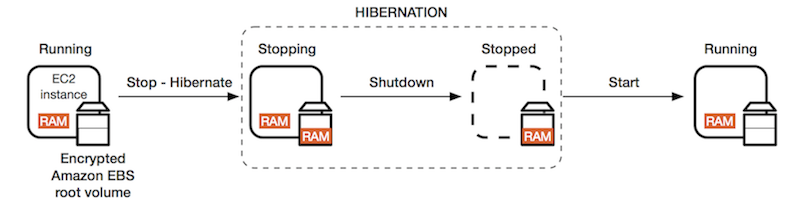

https://zhenye-na.github.io/aws-certs-cheatsheet
# AWS Region & Availability Zone
### Region
> A region is a geographical area. Each Region consists of 2 or more Availability Zone.

> region 是一个地理上的区域，每个region包含 2至多个 AZ

### Availability Zone
> An Availability Zone may be several Data Centers. If they (Data Centers) are close to each other, they may be counted as one Availability Zone.

> AZ 是一个或多个数据中心，如果数据中心距离较近会算作一个 AZ

### Edge Locations
> Edge Locations are endpoints for AWS which are used for caching content. Typically, this consists of CloudFront, Amazon’s Content Delivery Network.


### Exam Tips
1. A **Region** is a physical location in the world, which consists of two or more Availability Zones.
2. An **Availability Zone** is one or more discrete Data Centers, each with redundant power, networking, and connectivity, housed in a separate facility.
3. **Edge Locations** are the endpoints for AWS which are used for caching content. Typically, this consists of CloudFront, Amazon’s Content Delivery Network.

# Identity Access Management (IAM)
- IAM allows you to manage users, groups, roles, permissions (level of access) to the AWS console
IAM has a global view, not need to choose a Region

### IAM Features
IAM offers the following features:
1. Centralized control of your AWS account
2. Shared Access to your AWS account
3. Granular Permissions
4. Identity Federation (Active Directory, Github …)
5. Multi-Factor Authentication
6. Provide temporary access for users/devices and services where necessary
7. Allows you to set up your password rotation policy
8. integrates with many different AWS services
9. Support PCI DSS Compliance

### Terminology of IAM
> Users(a physicial person)<br>
> Groups(grant to users) <br>
> Roles (grant to a mechine or a AWS service)<br>
> Policies (a JSON formatted file, call Policy Document)

### IAM - Advanced
**AWS STS - Security Token Service**
- Allows granting limited and temporary access to AWS resources
- Token is valid for up to one hour (must be refreshed)
```
AssumeRole
AssumeRoleWithSAML
AssumeRoleWithWebIdentity
GetSessionToken
```
**Using STS to Assume a Role**
- Define an IAM Role within your account or cross-account
- Define which principals can access this IAM Role
- Use AWS STS to retrieve credentials and impersonate the IAM Role you have access to (AssumeRole API)
- Temporary credentials can be valid between 15 minutes to 1 hour
> 创建 IAM role并设置 role 的权限， 设置谁能通过 STS 获取 role，通过STS 相关 API 获取 role， 每个 STS 凭证可以保持最多 1 小时就要刷新


### Directory Services
- AWS Managed Microsoft AD
    - Create your AD in AWS, manage users locally, supports MFA
    - Establish trust connections with your on-premise AD
- AD Connector
    - Directory Gateway (proxy) to redirect to on-premise AD
    - Users are managed on the on-premise AD
- Simple AD
    - AD-compatible managed directory on AWS
    - Cannot be joined with on-premise AD

### AWS Organizations
- Global service
- Allows managing multiple AWS accounts
- The main account is the master account (cannot change this)
- Other accounts are member accounts
- Member accounts can only be part of one organization
- Consolidated billing across all accounts - one payment method
- API is available to automate AWS account creation

**Organization Units (OU)**

### Service Control Policies (SCP)
- SCP contains Allowlist or denylist IAM actions and can be applied at the Root, OU, or Account level
- SCP is applied to all the Users and Roles of the Account, including Root
The SCP does not affect service-linked roles
service-linked roles enable other AWS services to integrate with AWS Organizations and cannot be restricted by SCPs
- SCP must have an explicit Allow rule (since it does not allow anything by default)
> SCP 基于服务的控制策略，SCP 包含一个可以(或禁止)操作的服务和资源列表，可以分配给各个层级的 account。<br>
> SCP 不能影响与服务关联的 role(service-linked roles)<br>
> SCP 必须指定允许什么，因为默认它什么都不允许做

### IAM Roles vs Resource-Based Policies
Attach a policy to a resource versus attaching of a using a role as a proxy (STS)
When you assume a role (user, application, or service), you give up your original permissions and take the permissions assigned to the role
When using a resource-based policy, the principal does not have to give up his permissions
> 使用 STS 时，相当于放弃原有的权限，使用的是 assume 的 role<br> 
> 使用 resource-based policy 时，原有的权限依然存在

### IAM - Policy Evaluation Logic
As soon as there is an explicit deny, the result will be denied
> 有明确的拒绝时，以拒绝为准
```json 
"Statement": [
    {
        "Action": "sqs:*",
        "Effect": "Deny",
        "Resource": "*"
    },
    {
        "Action": [
            "sqs:DeleteQueue"
        ],
        "Effect": "Allow",
        "Resource": "*"
    }
]
// 这里 sqs:DeleteQueue 将不会生效，因为 sqs:* 被 Deny 了。
```
### AWS Resource Access Manager (RAM)
- Share AWS resources that you own with other AWS accounts
- Share with any account or within your Organization
- VPC Subnets, AWS Transit Gateway, Route53 Resolver Rules, License Manager Configurations

### AWS Single Sign-On (SSO)
- Centrally manage Single Sign-On to access multiple accounts and 3rd party business applications
- Integrated with AWS Organizations
- Support SAML 2.0 markup
- Integration with on-premise Active Directory
- Centralized permission management
- Centralized auditing with CloudTrail
### SSO vs AssumeRoleWithSAML


# Elastic Compute Cloud (EC2)
Amazon Elastic Compute Cloud is a web service that provides resizable compute capacity in the cloud.

EC2 Pricing Model / Type
- On Demand: pay a fixed rate by the hour, no commitment
- Reserved: provide a capacity reservation, minimum 1 year
  1. Standard Reserved Instance
  2. Convertible Reserved Instance
  3. Scheduled Reserved Instance
- Spot: based on “bid”, like stock, on-demand
- Dedicated Instances
- Dedicated Hosts: physical EC2 Instance

> - 按需付费，适合短时间使用
>   - 最高的费用，但是无需预付款
>   - 适用与无法预测合适会发生且不能中断的工作
> - 预付费(至少一年)：
>   - 标准的预付费
>       - 比按需付费节省 75%
>       - 需要指定实例的类型，
>       - 适合长时间使用的实例，比如 database
>   - 有可能变更实例类型的预付费
>       - 比按需付费节省 50%
>       - 可以改变实例类型
>   - 周期性的预留(比如每周的周末使用，其余时间不使用)
>       - 适合只在窗口时间运行的任务
> - 现货
>   - 用户设定一个可接受的最大使用费用，如果当前的实例费用小于这个费用则用户可以使用实例，一旦现货的价格超过用户设定的价格，AWS会通知用户，用户有权决定按照新价格继续使用还是停止使用。
>   - 比按需付费便宜 90%
>   - 适合运行不怕失败的任务，batch job， data analysis等
> - 实体的EC2
>   - 价格会贵一些
>   - 有完全的控制权，使用自己提供的软件 licens 
>   - 适合需要强力监管的工作

### Security Groups
“Network & Security” -> “Security Groups”

When you create a new inbound rule, you will also create a new outbound rule
- Security Groups are stateful
- Network Access Control List is stateless
- All inbounds traffic is blocked by default, all outbound traffic is allowed
- Changes to Security Groups take effect immediately
- You can have any number of EC2 instances with a Security Group
- You cannot block network access in the security groups, instead we should use “Network Access Control Lists” (VPC Section)
- Allow Rule (OK), Deny Rules (X)
> Security Group 类似 firewall 定义了入站出站规则，默认出站是 all traffic，入站是 none <br>
> SG的变更将立即生效，SG只能规定什么能进入，不能规定什么不能进入

Security Group controls the inbound and outbound traffic of EC2

Security Group acts as the role like:
- "firewall" (connection-wise) on EC2 Instance
- Access to Ports
- IP Ranges
- Inbound/Outbound Network

Referencing other Security Groups


### private & public IP
> 默认 EC2会有一个 private ip (ipv4)，如果想通过 internet访问EC2则需要一个 public IP<br>
> 可以通过将EC2 放入具有 IGW(Internet Gateway) 的subnet使其获取一个 public IP 以及一个 public DNS。但是每次 stop/start EC2 时，public IP会动态变化<br>
> 如果想使用固定的 public IP，可以将 EC2 绑定一个 Elastic IP(EIP)。

### EC2 User Data
> 创建 EC2 实例时，可以执行一些初始化操作，这些命令只在创建实例时执行一次。

### EC2 Instance Types - Main Ones
https://www.ec2instances.info
- R	High RAM usage
- C	High CPU usage
- M	(Medium) balanced usage application
- I	High I/O
- G	High GPU usage
- T2/T3 - burstable	burstable instance with a limit threshold
- T2/T3 - unlimited	unlimited burstable amount
> R 内存优化，适合缓存<br>
> C CPU优化，适合做计算或者DB<br>
> M 平衡行，适合做 WEB<br>
> I I/O优化，适合做 DB<br>
> G GPU 优化，适合ML或者图形工作<br>
> burstable 使用 CPU 积分在某些运算量激增的时间爆发大量性能，其余时间计算能力维持在基准线之下<br>
> unlimited 不限制爆发计算的时间，但是需要额外付费

### AMI
an image to use to create our instances
> AMI 可以共享给其他 account<br>
> 共享之后你依然是 AMI 的 owner<br>
> 要copy 一个AMI 那么这个 AMI 所有者的账号必须给你这个AMI保存的 EBS或者 S3 的read 权限<br>
> 不能 copy 加密的 AMI，除非加密的 key 和 snapshot 也共享给你，你可以用你自己的 key 重新加密 snapshot 然后做成新的 AMI<br>
> 不能 copy 使用了计费代码的 AMI， 你可以先 lanuch 一个 EC2，然后用这个 EC2 做一个 AMI<br>

### EC2 Placement Groups
安置策略，如何放置 EC2 实例
> - Cluster 集群式部署，实例都在一个机架一个AZ，具有很低的延迟，但是风险很高，一个机架 fail 所有instance全部宕机
> - Spread 分布式部署，实例分布在不同AZ，分散了风险，适合要求高可用的项目，每个 Group 做多支持 7个 instance
> - Partition 分区部署，类似分布式部署，在分布式的基础上按照机架进行分区，相同分区的instance在同一个机架上，适合 Hadoop，Kafka 等要求高可用的分布式系统，同一个 AZ 可达100 instance， 一个Group最多支持7个Partition

1. A clustered placement group cannot span multiple AZs, while a spread placement and a partitioned group can
2. The name you specify for a placement group must be unique within your AWS account
3. Only certain types of instances can be launched in a placement group, these types contain Compute Optimized, GPU, Memory Optimized, Storage Optimized, etc...
4. AWS recommend homogeneous instances within clustered placement groups
5. You cannot merge placement groups
6. You cannot move an existing instance into a placement group. You can create an AMI from your existing instance, and then launch a new instance from the AMI into a placement group

### Elastic Network Interfaces (ENI)
VPC中的一块虚拟网卡
> 创建EC2时默认带一个 primary ENI， 可以创建其他 ENI 并 attach到 EC2
> 每个ENI可以包含如下属性：
> 1. 一个 private IP
> 2. 一个 EIP
> 3. 若干个 SG
> 4. 一个 MAC 地址
> ENI 需要绑定一个AZ

### Hibernate EC2

> Stop 时使保存EC2 的运行状态(类似休眠)，这些state写入EBS的文件，ESB卷必须是加密的，且有足够的空间保存EC2 State

使用的场景：
- 长时间运行的流程
- 需要很长时间初始化
- 需要保存内存状态

### High Availability and Scalability - ELB & ASG
- 垂直扩展 scale up and scale down
- 水平扩展 scale in and scale out

**Horizontal Scalability**
- increase the number of instances/systems, distributed system

**Vertical Scalability**
- increase the size of the instance, like from t2.micro to t2.large, etc…

**HA (High Availability)**
1. HA usually goes hand-in-hand with Horizontal Scalability
2. HA means running your application/system in at least 2 data centers, to be specific, 2 AZs
3. HA can be both active or passive
    - active: Horizontal Scalability
    - passive: RDS Multi-AZ

There are two methods of Horizontal Scaling:
- Auto Scaling Group - ASG
- Load Balancer

### Load Balancing (Elastic Load Balancer - ELB)
Load Balancers are servers that forward internet traffic to multiple servers (EC2) downstream

But, why would we use a load balancer, anyway?
1. Spread load across multiple downstream instances
2. Expose a single point of access (DNS) to your application
3. Seamlessly handle failures of downstream instances, through health checks
4. Do regular health checks to your instances
5. Provide SSL Termination (HTTPS) for your website
6. Enforce stickiness with cookies
7. HA across AZs
8. Separate public traffic from private traffic
> 1. 分流
> 2. 对外暴露一个 DNS
> 3. 故障引流
> 4. 周期性的故障检查
> 5. 提供 HTTPS 访问
> 6. 增强 cookie 粘性
> 7. 跨AZ的HA
> 8. 分离公共和私有流量

There are three types of Load Balancers on AWS

- Application Load Balancer (ALB) 7层的层面
    - HTTP, HTTPS, WebSocket
    - supports SSL
- Network Load Balancer (NLB) 4层的层面
    - TCP, TLS (secure TCP) & UDP
    - supports SSL
- Classic Load Balancer (CLB)
    - HTTP, HTTPS, TCP
    - DO NOT support SSL


**Classic Load Balancer (CLB)**

This is just legacy Load Balancers

**Network Load Balancer (NLB)**

It balances TCP (layer 4) traffic

> 转发 TCP/UDP 流量

Forward TCP & UDP traffic to your instances. Network Load Balancer can handle millions of requests per second while maintaining ultra-low latencies, ~100ms, where 400ms for ALB

> 每秒处理数百万的请求，延迟低至 100ms，ALB需要 400ms

NLB has one static IP per AZ and supports assigning Elastic IP

> NLB 在每个 AZ 有一个静态 IP，支持挂载 EIP

**Application Load Balancer (ALB)**

It balances HTTP / HTTPS traffic, you can also create
> 转发 HTTP/HTTPS 流量 (layer 7)
- advanced request routing
- sending specific requests to specific web servers

> 可以通过设置 rule 来指定请求转发至下游的哪个 target Group<br>
> 比如根据请求的路径转发流量

**Target Groups**
> Each target group is used to route requests to one or more registered targets.

where targets can be:

- EC2 Instances (can be managed by an ASG) - HTTP
- ECS tasks (Elastic Container Service) - HTTP
- Lambda functions - HTTP request if translated into a JSON event
- IP Address - must be private IPs

ALB can also route to multiple target groups, also, Health checks are at the target group level
> ALB 可以转发流量至多个 targetGroup， healthCheck 是 targetGroup 级别的

it has a fixed hostname, (xxx.<region>.elb.amazonaws.com, etc..)
> ALB 有一个域名

the application servers don't see the IP of the client directly, if you wanna see, then:
the true IP of the client is inserted in the header X-Forwarded-For
we can also get the Port (X-Forwarded-Port) and proto (X-Forwarded-Proto)
> 应用端不能直接获取客户端的 IP，客户端的IP放在请求的 header 的 (X-Forwarded-For) 以及 (X-Forwarded-Proto) 中

**Sticky Sessions**

Sticky Session allows you to bind a user’s session to a specific EC2 Instance. This ensures that all requests from the user during the session are sent to the same instance

you can enable the “sticky session” for Application Load Balancer, but the traffic will be sent at the “Target Group” level, rather than Individual EC2 Instance
> 粘性 session 将 client 的流量导向同一个 targetGroup。CLB和ALB都支持，对于 ALB 需要在 targetGroup 开启 sticky session，并设置持续时间，它是利用 cookie 来实现的。

**Cross-zone Load Balancing**

- With Cross Zone Load Balancing each load balancer instance distributes evenly across all registered instances in all AZ
- Otherwise, each load balancer node distributes requests evenly across the registered instances in its AZ only

> 有了跨AZ的 load Balance， 每个 balancer 将转发流量到分布在每个AZ的 EC2 实例<br>
> 不使用跨AZ的 LB， 每个 balancer 将转发流量到当前AZ的 instance

Cross-Zone in 3 types of Load Balancers

- Application Load Balancer
  - Always on (cannot be disabled)
  - No charges for inter AZ data
- Network Load Balancer
  - Disabled by default
  - You pay charges for inter AZ data is enabled
- Classic Load Balancer
  - Disabled by default
  - No charges for inter AZ data is enabled

**Elastic Load Balancer - SSL Certificates**
> 要使用安全的链接 SSL/TSL 需要在LB上添加 HTTPS/TSL Listener，同时指定一个 CA证书<br>
> CLB 不能同时使用多个证书<br>
> ALB 和 NLB 可以为每个 targetGroup指定一个证书，他们使用 SNI 技术来区分转发流量时使用哪个证书加密。

### Auto Scaling Group (ASG)
the goal for an ASG is to:

1. Scale in or scale out to match an increased load or decreased load
2. Ensure minimum / maximum number of running instances
3. automatically register new instances to a load balancer

> 1. 为了应对负载的增加/减少，而水平扩展/缩减
> 2. 确保运行的实例数在 min/max 之间
> 3. 自动将新 lanuch 的实例注册到 LB


**Scaling Policies**
- Target Tracking Scaling
    - Most simple and easy to set-up
    - Example I want the average ASG CPU to stay at around 40%
- Simple / Step Scaling
    - When some metrics is triggered, do something
- Scheduled Actions
    - eg. increase the min capacity to 10 at 5 pm.

### Elastic Block Store (EBS) EBS
> - 类似一个 USB，可以快速的 attach 给一个实例，
> - 只能在同AZ内相互传递，不能跨AZ
> - 需要为所有容量付费(即使只用了一部分)
> - 4种型号：
>   - GP2(SSD): 普通的SSD，兼顾价格和性能，适合多样性的工作，100-3000 IOPS，最高 16000IOPS， 1GB-16TB
>   - IO1(SSD): 高性能SSD，适合重要的任务，低延迟，高吞吐量，100 - 32000 IOPS，适合大型数据库，4GB-16TB
>   - ST1(HDD): 便宜的HDD，为了频繁访问加强过的HDD，适合想用低价格获取高速读取性能，适合大数据量，数据仓库，日志处理,500GB-16TB，最大500IOPS，最大500MB/s的吞吐量，
>   - SC1(HDD): 最便宜的HDD，适合不经常访问的数据，最大250MB/s的吞吐量，
> - 共同特征是 Size(容量) Throughput(吞吐量，每秒读写数据量) I/OPS(I/O pre Sec，每秒访问次数)
> - 只有SSD可以作为 EC2 的 boot volumes

**EBS Snapshots**
> - 只能做增量复制
> - Snapshots 保存在S3上，但是我们看不见
> - 可以不在 detach volume时做Snapshot，但是推荐先 detach
> - 最多 100000 个Snapshots
> - 可以跨AZ复制，可以用于制作AMI
> - EBS从 Snapshots中恢复数据有个预热的过程
> - Snapshots可以被Amazon Data Lifecycle Manager自动使用(自动备份)

**Encryption**
> 加密EBS
> - EBS 内保存的数据是加密的
> - 数据的访问过程也是加密的
> - 相关的 Snapshots 也是加密的
> - 加密/解密的过程我们无需做任何操作
> - 加密会有一个较小的延迟
> - 使用KMS AES-256 加密
> - copy Snapshots 时可以选择加密
> - 加密的 Snapshots 的 volumns 也是加密的

1. Volumes exist on EBS, think of EBS as Virtual Hard Disk
2. Snapshots are on S3, think of Snapshot as photo of disk
3. Snapshots are the point in time copies of volumes
4. EBS Snapshots are incremental, only the blocks that have changed since your last snapshot are moved to S3
5. To create a snapshot for Amazon EBS Volumes that serve as root devices, you should stop the instance before taking the snapshot
6. You can create AMIs from Volumes and Snapshots
7. You can change EBS Volume sizes on the fly, including changing the size and storage type
8. Volume will ALWAYS be in the same AZ as the EC2 Instance, BUT you can copy snapshots across AZ or Region
9. EBS Backup will utilize IO so you should not enable it while handling a lot of traffic
10. Recommend - detach the EBS volume to do the backup, but not a must
11. EBS volumes restored by snapshots need to be pre-warmed (using fio or dd command to read the entire volume)
12. snapshots can be automated using "Amazon Data Lifecycle Manager"

**Instance Store**
Local EC2 Instance Store is a physical disk attached to the physical server where your EC2 is

it has very high IOPS, but the size of it cannot be increased and the data will be lost if hardware fails to happen
> Instance Store 是挂载在EC2上的实体硬盘，具有非常高的IOPS，但是不能增加容量，并且重启EC2时，数据会丢失。<br>
> 只有某些机型具有 Instance Store

**EBS RAID**
EBS is replicated within an AZ so it is already redundant storage. But if you want to increase the IOPS more or you want to mirror your EBS volumes, then you need to mount volumes in parallel in RAID settings. (RAID is possible as long as your OS supports it)
> EBS 在同AZ中默认时冗余存在的，但如果想增加 IOPS，那么需要在RAID中设置并行挂载(如果EC2的系统支持的话)

Normal RAID options:

- RAID 0
- RAID 1
- RAID 5 - not recommended for EBS
- RAID 6 - not recommended for EBS

RAID 0 - increasing performance
- Combining 2 or more volumes and getting the total disk space and I/O
- But one disk fails, then all the data is failed

Use cases:
    - application needs a lot of IOPS and doesn’t need fault-tolerance
    - a database that has replication already built-in
Using this, we can have a very big disk with a lot of IOPSCombining 2 or more volumes and getting the total disk space and I/O
But one disk fails, then all the data is failed
> 将多个EBS卷合并为一个，提供更高的吞吐，但是提高了数据丢失的风险，一旦一个EBS失效，那么所有EBS将全部失效，数据将全部丢失。

RAID 1 - increase fault tolerance

RAID 1 is to mirror a volume to another, which means if one disk fails, then our logical volume is still working (since there is our mirroring one)

Use case:
    - application that needs to increase volume fault tolerance
    - application that needs service disks
> 增加容错性，不会改变总容量和总吞吐量，会增加一点延迟

### EFS (Elastic File System)

EFS is a managed NFS (network file system) that can be mounted on many EC2, EFS can work with EC2 instances in multi-AZ.

EFS is a High Available, Scalable, and expensive service(3x GP2)

**EBS or EFS**
- EBS 同一时间只能 attach 给一个 EC2 实例
- EBS 是AZ锁定的，不能跨分区
- 想要迁移 EBS 需要先把EBS做成 snapshot 然后把 snapshot 分享给其他 AZ 或 account，再利用 snapshot 重建EBS
- EBS制作snapshot的过程需要 I/O ，所以不应该占用 APP 正常应用的时间
- 默认情况下 EC2 的 root EBS在 terminated 时删除，可以手动关闭这个设置
- 系统的I/O需求增大，可以增加 EBS的 size，或者attach 高吞吐的 EBS 类型
- EFS 可以attach 给多个EC2，并且可以跨AZ， EFS比 EBS贵3倍(GP2)
- EFS 适合 share file，等需要共享存储的工作
- EBS 制作的 AMI (snapshot) 可以被 ASG 使用，快速的 scale out

# Relational Database Service (RDS)
> RDS 是全托管的关系型数据库服务，支持 MySQL PostgreSQL MariaDB Oracle SQLServer Aurora

RDS is a managed service:
- Automated provisioning, OS patching
- Continuous backups and restore to specific timestamp (Point in Time Restore)
- Monitoring dashboard
- Read replicas for improved read performance
- Multi-AZ setup for Disaster Recovery
- Maintenance windows for upgrades
- Scaling capability (vertical and horizontal)
- Storage backed by EBS (gp2 or io1)

**BUT, you cannot SSH into your instances**

There are two important features for RDS

1. Multi-AZ: this is for “Disaster Recovery”
2. Read Replicas: this is for “Improving Performance”

Read Replica 

> Read Replicas 增加性能<br>
> 三种只读副本(主要区别是跨区域访问的流量费用和延迟)
> - 同 AZ(不产生流量费用)
> - 跨 AZ
> - 跨 Region
> 
> 副本同步是异步进行的，所以只能达到最终一致，不能实现强一致<br>
> 副本可以提升为独立的数据库使用，提升之后就脱离了原有的副本机制<br>
> 每个副本有独立的 endpoint 需要手动切换 connection的URL来连接到副本数据库<br>
> 可以创建副本的副本<br>
> 最多可以创建5个副本<br>

Multi-AZ

This is an exact copy of your production database in another AZ
Automatically synchronized when your prod database is written to
In the event of the following:
planned database maintenance
DB instance failure
AZ failure
Network failure
This is only for Disaster Recovery, increase availability

> Multi AZ 故障恢复，增加可用性<br>
> 在不同的AZ维护一个完全 copy的副本，自动同步副本
> 对外暴露统一的 DNS name 进行访问，自动进行 failover
> 增加了数据库的可用性
> 可以把 Read Replicas 做成 Multi AZ用于故障恢复

**Backups**

There are two types of Backups for RDS:
- Automated Backups
- Database Snapshots

*Automated Backups*

It allows users to recover your database to any point in time within a “Retention Period”, this is around 7 ~ 35 days.

Automated backup is enabled by default, the backup data is stored in S3, meanwhile, the size of your RDS is equal to the size of S3

- Daily full backup of the database (during the maintenance window)
- Transaction logs are backed-up by RDS every 5 minutes
- This gives the ability to restore to any point in time (from oldest back-up to 5 minutes ago)
- 
> 自动备份，备份的文件可以保存7~35天，RDS默认开启自动备份，数据保存在S3上<br>
> 每天在维护窗口时间自动备份<br>
> 数据库的操作日志每5分钟自动备份<br>
> 可以恢复任意时间点的数据，最早到最早的备份，最新到最近的5分钟<br>

*Database Snapshot*

Database Snapshot is stored even after you delete the original RDS Instance

But it is manually triggered by the user, and retention of backup for as long as you want
> RDS 的 snapshot 使得即使删除了 RDS 实例数据库的数据依然保留了下来<br>
> snapshot 需要手动触发<br>


**RDS Securities**
*Encryptions*

This is achieved by using AWS KMS (Key Management Service), once the encryption is on, the followings are encrypted:

- data underlying storage
- automated backups
- read replicas
- database snapshots
> RDS 可以被KMS加密(AES-256)， 加密之后，数据后台数据被加密，自动备份被加密，只读副本被加密，snapshot也被加密<br>
> 只有创建 RDS 时可以选择加密，主库不加密，从库能加密<br>

We can encrypt the primary DB and read replicas with AWS KMS - AES - 256 encryption, this has to be defined at launch time.

If the primary DB is not encrypted, the read replicas cannot be encrypted

*At rest encryption and In-flight encryption*

This allows to use SSL Certificates to encrypt data to RDS in flight, you have to provide SSL options with trust certificate when connecting to the database

> 可以使用SSL进行加密访问数据库

*Network Security*

RDS databases are usually deployed with a private subnet, not in a public one
RDS security works by leveraging security groups, it controls which IP / security group can communicate with RDS
*Access Management*

IAM policies help control who can manage AWS RDS through the RDS API, like “who can create a read replica? etc..”
traditional username/password can be used to log into the database
IAM-based authentication can be used to login to RDS MySQL & PostgreSQL

> RDS 通常被创建在私子网中，Network 被 SG 所保护，SG 控制谁能连接到 RDS<br>
> IAM Role 控制谁能对RDS进行管理<br>
> 可以使用 username/password 登录数据库使用<br>
> 也可以使用 IAM role(MySQL & PostgreSQL支持)登录数据库<br>

*IAM Authentication*
works with MySQL & PostgreSQL
no need for a password, just a token obtained through IAM & RDS API call
the token has a lifetime of 15 minutes
the IAM Authentication has the following benefits:

Network in/out must be encrypted using SSL
IAM to centrally manage users instead of DB
Can leverage IAM Roles and EC2 Instance profiles for easy integration

> 使用 IAM 登录数据库时，不需要设置 username/password ，只需要
> 通过 IAM 和 RDS API的调用获得 token
> token 可以维持 15分钟
> 必须通过SSL连接

### Aurora
> AWS 专属的服务，支持 MySQL 和 PostgreSQL<br/>
> Aurora 号称比 MySQL快5倍，比 PostgreSQL 快3倍<br>
> 自动增长的容量 10GB - 64TB<br>
> 最多可以有 15个只读副本<br>
> 自动故障恢复，原生支持 HA<br>
> 比 RDS 贵20%<br>

**Aurora HA and Scalability**
Aurora always maintains 2 copies of your data in each AZ, with a minimum of 3 AZ => which leads to 6 copies of your data

Among these 6 copies of your data across 3 AZ:
4 copies out of 6 needed for writes
3 copies out of 6 needed for reads
self-healing with peer-to-peer replication
storage is striped across 100s of volumes

> Aurora 总是在每个AZ保持 2个副本，最少保证写入3个AZ，也就是6个副本，分布在 3个AZ 上<br>
> 4个副本用于写入，3个用于读取<br>
> 通过 *对等复制* (对等复制解决了写的瓶颈，所有节点不分主从都可以读写)来实现自我修复 <br>
> 存储是带状的横跨数百个 volumes <br>
> 默认只有一个 master ，可以创建 15个只读副本，master宕机时只读副本可以自动升级为master， 只读副本可以跨 region<br>
> master 和 只读副本是两个 Endpoint

- Writer Endpoint
- Reader Endpoint
- Shared storage Volumes
- Auto Scaling

*Aurora Serverless*

Automated database instantiation and autoscaling based on actual usage
good for infrequent, intermittent, or unpredictable workloads
no capacity planning needed
pay per second, can be more cost-effective

> 根据实际使用情况自动创建与扩展实例，适合间歇性，不可预知的任务，按秒计费

*Global Aurora*
- Aurora Cross Region Read Replicas
    - Useful for disaster recovery
    - Simple to put in place
- Aurora Global Database (recommended)
    - 1 Primary Region (read / write)
    - Up to 5 secondary (read-only) regions, replication lag is less than 1 second
    - Up to 16 Read Replicas per secondary region, helps for decreasing latency
    - Promoting another region (for disaster recovery) has an RTO (Recovery Time Objective) of < 1 minute
> 两种方式实现跨Region访问的 Aurora，
> - 跨 Region 的只读副本(在其他 Region创建只读副本)
>   - 适合灾难恢复
>   - 简单有效
> - 使用 Global 版 Aurora
>   - 一个主Region负责读写
>   - 最多5个副 Region 只读，数据同步延迟低于 1s
>   - 每个副Region可以有 16个只读副本，用于减少延迟
>   - 灾难恢复时，提升副Region为主Region 耗时小于1分钟

### ElastiCache

- The same way RDS is to get managed Relational Databases 
- ElastiCache is to get managed Redis or Memcached
- Helps reduce the load off of databases for reading-intensive workloads
- Make application stateless
- Write Scaling using **Sharding**
- Read Scaling using **Read Replicas**
- Multi-AZ with failover Capability
- AWS takes care of OS maintenance/patching, optimizations, setup，configuration, monitoring, failure recovery, and backups

Application queries ElastiCache first, if data is not available (cache miss) then get data from RDS and store in ElastiCache, so that for the later queries, it will reach cache hit

> 应用首先查询 cache，如果没有可用数据(cache miss)，再从 RDS 查找数据并存在 cache 中，以便后续的查找可以从 cache 中获取数据(cache hit)

> 减少 RDS 的负载，设定失效策略，保证数据是最新的
 
*User Session Store*
> 帮助实现 statless 的系统，多个实例可以从 cache 中获取用户的登录状态

ElastiCache - Redis or Memcached
<table>
<tr><th>Redis</th><th>Memcached</th></tr>
<tr><td>Multi-AZ with Auto-Failover</td><td>Multi-node for the partitioning of data (sharding)</td></tr>
<tr><td>Read Replicas to scale reads and have high availability</td><td>Non persistent</td></tr>
<tr><td>Data Durability using AOF persistence</td><td>No backup and restore</td></tr>
<tr><td>Backup and restore feature</td><td>Multi-threaded architecture</td></tr>
</table>
If you need scale horizontally, you need to choose Memcached
If you need Multi-AZ, Backups, and Restores, you need to choose Redis

> Redis 可以跨 AZ，故障恢复，Memcached可以水平扩展，但是不能故障恢复

**ElastiCache - Cache Security**
All caches in ElastiCache:
- support SSL in-flight encryption
- Do not support IAM authentication
- IAM policies on ElastiCache are only used for AWS API-level security

*Redis AUTH*

- You can set a “password/token” when you create a Redis Cluster
- This is an extra level of security for your cache (on top of Security Group)

*Memcached*
- Supports SASL-based authentication

**ElastiCache for Solutions Architects**
Patterns for ElastiCache

1. Lazy Loading: all the read data is cached, data can become stale in the cache
2. Write Through: Adds or Update data in the cache when written to a DB (no stale data)
3. Session Store: store temp session data in the cache (using TTL features)

> Computer science 最难的两件事： 缓存失效，事物命名

# AWS Rout53
- Route 53 is a Managed DNS(Domain Name System), 不区分Region
- DNS is a collection of rules and records which helps clients understand how to reach a server through URLs
- In AWS the most common records are:
  - A: URL to IPv4
  - AAAA: URL to IPv6
  - CNAME: URL to URL
  - Alias: URL to AWS resources

- Route 53 can use:
  - public domain names you own
  - private domain names that can be resolved by your instances in your VPCs

**DNS Records TTL(Time to Live)**
> client 访问某个域名时，先访问会 Route 53，Route 53 返回域名对应的 IP给client 并且附带了一个TTL，浏览器会根据TTL的时间对域名映射的IP地址进行缓存。<br>
> 长时间的 TTL 可能会导致recorde失效(DNS recorde 更改)<br>
> 短时间的 TTL 会导致大量的流量进去 Route 53<br>
> 需要对TTL做取舍，每条 record 都有一个TTL

**CNAME vs Alias**
- 想把 AWS 服务提供的域名映射为自定义的域名应该使用哪种recorde
- CNAME:
  - Points URl to URL(app.mydomain.com => app.anotherdomain.com)
  - 只支持子域名的映射，不支持根据名的映射(不支持 mydomain.com)
- Alias:
  - Points URl to URL(app.mydomain.com => app.anotherdomain.com)
  - 支持根域名和子域名
  - 免费
  - 原生的 health check 

**Routing Policy**

*Simple Routing Policy*
- map a domain to one URL(也可以 map 到多个 URL)
- 当想重定向请求时使用
- 不能使用 health checks
- 如果向客户端返回了多个值，客户端将随机访问其中一个

*Weighted Routing Policy*
- 按 % 控制多少流量进入指定的 endpoint
- 在进行新 app 测试时将少量流量引入新 app 的地址
- 可以按照 Region 来区分流量
- 可以使用 health check
- (多条记录，每条 map 一个URL并指定权重)

*Latency Routing Policy*
- 重新向请求到延迟最低的 URL
- 根据用户到对应 AWS Region的时间来评估延迟
- 对于延迟要求很高的 app 非常有用
- (多条记录，每条 map 一个URL并指定 Region)

*Failover Routing Policy*
- 必须结合 health check使用
- 自动将 unhealth 的流量转发给 health的URL

*GEO Location Routing Policy*
- 与基于延迟的策略不同
- 基于用户所在的地理位置进行路由
- 必须有一个 default 的记录保证默认的路由
- 每条记录可以选择一个区域

*Multi Value Routing Policy*
- 适合需要路由流量到多个 URL
- 想要使用 health check
- 每个 Multi Value Record 最多可以返回 8 个URL
- 它不是 ELB 的替代品

**Health Checks**
- 单独创建，并可以与 Route 53的某些 Policy集成，帮助判断某个域名是不是挂了
- 默认 3个 failed/success 来切换health check 的状态
- 默认 30 秒进行一次 health check(更短的间隔，更高的花费)
- 后台有大约 15个 health checker 来 check endpoint(总体下来，平均间隔 2s 左右一次 check)
- HTTP/HTTPS/TCP ，不支持SSL认证
- 可以与 CloudWatch集成(监控 CloudWatch 的 Alarm 是否报警了)

**Route 53 as a Registrar**
> Route 53也是一个域名供应商。可以在 Route 53 上使用从第三方购买的域名。
> 1. 在 Route 53上创建 Hosted Zone
> 2. 在第三方域名供应商更新 name server 的记录，使用Route 53 的name server

## Architectures 架构方案

*Statesless Web App: WhatIsTheTime.com*
> WhatIsTheTime.com 是一个最简单的示例网站，给用户提供当前的时间<br>
> 目标：
> - 完全的自动的垂直和水平扩展
> - 没有宕机时间(高可用)

1. 一个 EC2 + EIP，为用户提供简单的响应
2. 用户越来越多，当前实例不够了，考虑垂直扩展，但是在升级EC2时，有downtime，不友好。
3. 继续，用户暴增，一个实例不够了，考虑水平扩展，每个实例对应一个 EIP，用户需要记录每个 EIP 来进行访问，不友好。
4. 为了友好的访问，不使用EIP，使用 Route 53 将一个域名映射到各个EC2 IP，但是 record 是固定的，这在我们进行水平扩展时会出现问题(重启实例 IP 会变)，用户由于 **TTL**，将会被路由到已经 stop的EC2，不友好
5. 将所有 EC2 挂载 ELB 下，并使用 Route53将 公开域名映射到 ELB的域名，这样用户访问就没有问题了，水平扩展时，ELB也会对流量做出响应的转发。对用户友好了，但是水平扩展需要手动操作。
6. 使用 ASG 对 EC2 的水平扩展进行管理，省去了人工维护。当前所有 EC2， ASG，ELB 处于用一个AZ，这时地震了，这个AZ down了。
7. 开启 ELB 的跨 AZ 以及 health check， 并且开启 ASG 的跨 AZ 在多个 AZ 之间部署 EC2，实现 HA。看上去很完美了。
8. 开始考虑成本问题，可预见的必须使用的 EC2 实例(比如 每个AZ至少一个 EC2)，那么可以使用 RI 进行预留。

considering 5 pillars for a well achitected application:
costs, performance, reliability, security, operational excellence

> 架构师要考虑我的系统需要什么，以及如何满足这些需求<br>
> 一个好的架构的 5 大支柱：
> - 成本
> - 性能
> - 可用性
> - 安全性
> - 易用性(容易运维)

*Statesless Web App: MyClothes.com*
> MyClothes.com 一个购物网站
> - 同一时间有很多用户，需要根据用户量水平扩展，保持 stateless<br>
> - 扩展的同时，不能丢失用户的购物车<br>
> - 需要记录用户的基础信息，比如用户名等等<br>

1. 假设我们拥有了之前的可伸缩高可用架构，现在需要记录用户的 shopping cart，可以使用 ELB 的 sticksession，但是 scale in/out 时，依然会丢失信息。
2. 考虑使用 cookie 来记录 shopping cart，但是需要 client 开启 cookie 功能，并且这增加了 HTTP 请求时发送的数据，同时 cookie 也不能记录很大的数据量。
3. 考虑使用 Elastic Cache，client 每次请求会附带 sessionId 信息，利用 sessionId 将shopping cart 记录在 cahce 中，这样就解决了 shopping cart 问题。
4. 如何保存用户的信息，商品信息这些基础信息，使用 RDS。
5. 用户量开始增加，由于大量的用户访问是 READ 操作，考虑使用 RDS 的只读副本分担读取的压力，这会带来成本的上涨。
6. 改变思路，使用 cache 缓存商品信息，client 访问时先查cache ，cache miss 则查询RDS，并缓存到 cache，后续的请求则会 cache hit，减轻了 RDS 的压力。
7. 新能足够了，开始考虑高可用性，开启 RDS 和 Elastic Cache 的 MultiAZ，实现高可用。
8. 最后，考虑安全问题，对外的入口是 ELB，所以ELB 的 SG 开启 all traffic，EC2 的 SG 只允许 ELB的 SG 的 HTTP流量， RDS和ElasticCache 的SG 只开启 EC2 SG对应端口的 TCP流量。保证安全性。
9. 成本问题，在满足性能的前提下，购买RI，使用最少的实例。

> 总结：
> - 这是一个最简单的 3 层架构应用
>   1. client tier (Route 53, ELB)
>   2. web tier (EC2, ASG)
>   3. database tier (RDS, ElasticCache)

*Statesful Web App: MyWordPress.com*
> MyWordPress.com 是一个常见的类似博客的网站。<br>
> 可以上传图片，用户的博客要保存，再次访问时可以看到之前保存的内容<br>

1. 考虑如何保存基础信息和用户数据，可以使用 RDS, 或者高性能的 Aurora。
2. 图片类数据可以放在 EC2 的 EBS 上，但是水平扩展时，用户的数据有可能保存在其他的EC2的EBS上。
3. 考虑使用 EFS， 使所有 EC2 实例可以从 EFS 上读取相同的数据。

> 总结：
> 如何选择高性能的数据库，容易的使用 Multi AZ，backup 等功能(Aurora)<br>
> 如何保证分布式系统统一的存储(EFS 比 EBS 贵，但是好处更多)<br>

**Instantiating Applications quickly**
> 如何快速部署我们的系统，充分发挥云上的优势：
> - EC2 instances：
>   - 使用 Golden AMI：把应用需要的application全部装好，并制作成 AMI，当lanuch其他instance 时，使用这个 Golden AMI
>   - 使用 user data，来进行一些个性化配置。
>   - 将上面两个集合使用(ElasticBeanstalk)
> - RDS:
>   使用 snapshot 快速的部署一个数据库
> - EBS：
>   使用 snapshot 快速的迁移数据


# ElasticBeanStalk
EB is a developer centric view of deploying an application on AWS
> ElasticBeanStalk 帮助 developer 快速部署应用程序，它使用到 EC2 ELB ASG RDS等等应用需要的服务<br>
> 所有这些用到的服务都在一个 view 里呈现，方便管理<br>
> BeanStalk 免费，底层用到的服务收费<br>

- 完全托管的服务：
  - EB帮我们配置底层的EC2
  - 我们只需要管理我们的应用代码
- 三种部署模式：
  - Single Instance，单点模式，适合 dev环境
  - LB + ASG： 适合 PV 和 PROD 环境
  - ASG： 只有 ASG， 适合非 web 应用
- 三个组件：
  - Application
  - Environment
  - Application version
> 可以将某个 Application version 部署到某个 Environment，也支持回滚操作<br>
> 部署 application 三部曲：create application & environment -> create application version -> release to environment<br>
> 支持多种应用类型<br>

