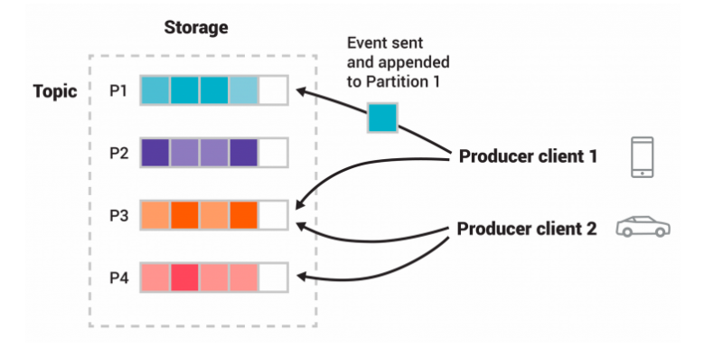
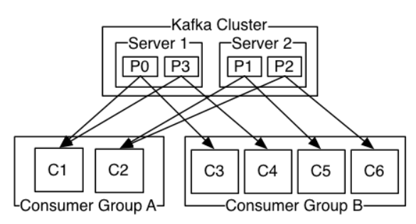
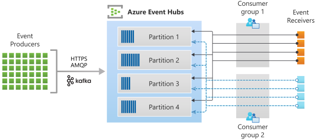

联网车辆的数据无时无刻都在产生，心跳数据，运行数据，故障数据等
如果直接收取数据，那么可能会产生很多问题。
我们需要一个中间层去缓冲，保存消息。 
保证发数据的车辆不会直接对接我们的处理平台。
也不会因数据量突然增加影响到我们的。
还可以保存数据，以便在发生故障时重新读取数据，做故障恢复。
假如我们有多个处理平台也可以一起从这个中间层获取数据。
这样一个中间层，或者叫中间件就是 消息平台

比如快递公司，发件人和收件人。发件人不用等到收件人收到，把快递给快递公司就行。
收件人也不用对接发件人，只要在收到快递公司有快递的提醒后去代收点取快递就行。
快递公司负责快递的配送，提醒和分发。

**两种消息模型**

队列模型
> 一个消息件发给一个人
例如：发快递
  发件人 --> 物流 --> 收件人

发布-订阅模型
> 一个消息发给多个人、多个人同时消费
例如：订报纸
  用户 --> 订阅 --> 报纸

### 常用的消息中间件
- ActiveMQ
- RabbitMQ
- RocketMQ
- Kafka
- Kinesis
- EventHub

## Kafka
> Apache Kafka is an open-source distributed event streaming platform 
> used by thousands of companies for high-performance data pipelines, streaming analytics, data integration, and mission-critical applications.
> 开源分布式事件流平台，被数千家公司用于高性能数据管道、流分析、数据集成和关键任务应用程序。

Core Capabilities
- High Throughput
  > Deliver messages at network limited throughput using a cluster of machines with latencies as low as 2ms. 
  > 高吞吐量，以网络有限的集群吞吐消息，延迟最低 2ms。
- Scalable
  > Scale production clusters up to a thousand brokers, trillions of messages per day, petabytes of data, hundreds of thousands of partitions. Elastically expand and contract storage and processing. 
  > 可扩展性，可以扩展至上千个节点，处理每天数万亿条消息，数PB数据，数十万分区。
- Permanent Storage
  > Store streams of data safely in a distributed, durable, fault-tolerant cluster. 
  > 持久化存储，将数据保存在分布式、持久化、容错的集群上。
- High Availability
  > Stretch clusters efficiently over availability zones or connect separate clusters across geographic regions. 
  > 高可用性，可以跨可用区部署及扩展。

**工作原理:**
> Kafka 是一个分布式系统，通过高性能 TCP 网络协议进行通信，由客户端和服务端组成，可以部署在本地，云环境，虚拟机，容器上。
- 服务端
  > Kafka 作为一个或多个服务器的集群运行，这些服务器可以跨越多个数据中心或云区域。
  > 其中一些服务器形成存储层，称为代理（Brokers）。
  > 其他服务器运行 Kafka Connect以将数据作为事件流持续导入和导出，从而将 Kafka 与现有系统（例如关系数据库以及其他 Kafka 集群）集成。
  > 为了让您实现关键任务用例，Kafka 集群具有高度可扩展性和容错性：如果其中任何一个服务器出现故障，其他服务器将接管它们的工作，以确保连续运行而不会丢失任何数据。
- 客户端
  > 它们允许您编写分布式应用程序和微服务，即使在网络问题或机器故障的情况下，它们也可以并行、大规模和容错方式读取、写入和处理事件流。
  > Kafka 附带了一些这样的客户端，这些客户端通过 Kafka 社区提供的数十个客户端进行了扩充 ：客户端可用于 Java 和 Scala，包括更高级别的 Kafka Streams库，用于 Go、Python、C/C++ 和许多其他编程语言以及 REST API。

**概念和术语:**
- 事件记录(Records)
  > 实际发生的某件事，也被叫做消息或记录。Kafka 写入或读取数据时，以事件记录的形式进行操作。
  > 事件具有：
  > - 事件键(key)
  > - 事件值(value)
  > - 时间戳(timestamp)
  > - 元数据(metadata)
- 生产者(Producers)
  > 向 Kafka 写入(发布)事件的客户端
- 消费者(Consumers)
  > 从 Kafka 读取(订阅)事件的客户端
- 主题(Topics)
  > 事件记录被组织并持久化存储在主题中，类似文件系统中的文件夹，事件是文件夹中的文件。
  > 主题总是对应多个生产者和消费者。
  > 同一时间可以由一至零个生产者写入事件，也可以有一至零个消费者读取事件。
  > 事件在消费后不会被立即删除，可以通过配置设定保留多久才会被丢弃。
  > 保存多久对于Kafka的效率完全没有影响，只会消耗存储空间。
- 分区(Partitions)
  > 一个主题可以分布在不同的 Brokers 的多个 ”Bucket“ 中。
  > 这种处理方式对于可伸缩性非常重要，正是因为有分区，客户端才可以同时向多个 Brokers 写入/读取 事件。
  > 事实上事件被写入主题时是写入到它的一个分区中。
  > 具有相同事件键的事件被写入同一个分区，并且Kafka 保证同主题同分区的消费者将以事件的写入顺序进行消费。
- 副本(Replications)
  > 主题可以拥有副本，用于保证容错性。
  > 通常的副本数量为3， 也就是每个主题保留3分副本
  
**四个核心API:**
- The Producer API 允许一个应用程序发布一串流式的数据到一个或者多个Kafka topic。
- The Consumer API 允许一个应用程序订阅一个或多个 topic ，并且对发布给他们的流式数据进行处理。
- The Streams API 允许一个应用程序作为一个流处理器，消费一个或者多个topic产生的输入流，然后生产一个输出流到一个或多个topic中去，在输入输出流中进行有效的转换。
- The Connector API 允许构建并运行可重用的生产者或者消费者，将Kafka topics连接到已存在的应用程序或者数据系统。比如，连接到一个关系型数据库，捕捉表（table）的所有变更内容。

> 生产者和消费者之间是完全解耦的，不需要相互等待。
> 同一时间同一个分区只能有一个生产者/消费者 写入/读取。
> 同分区之内消息的顺序与写入的顺序保持一致，消费时也保证与写入的顺序保持一致。
> 事件写入分区后实际上被保存在主题/分区文件夹下的文件内，文件以偏移量(offset)命名，方便快速索引。

## Azure EventHub
> EventHub 是大数据流式处理平台和事件引入服务。 
> 它可以每秒接收和处理数百万个事件。 
> 可以使用任何实时分析提供程序或批处理、存储适配器，转换和存储发送到事件中心的数据。
> 事件中心是完全托管的平台即服务 (PaaS)

**概念和术语:**
- 命名空间
  > 事件中心命名空间提供 DNS 集成网络终结点与一系列的访问控制和网络集成管理功能（例如 IP 筛选、虚拟网络服务终结点和专用链接）。
  > 并且是用于多个事件中心实例（或 Kafka 用语中的“主题”）之一的管理容器。
- 分区  
  > Event Hubs organizes sequences of events sent to an event hub into one or more partitions.
  > Event Hubs 用分区来组织数据。分区最大数量根据定价层级而定。
  > 同一分区的数据可以保证顺序。
- 分区路由
  > 可以指定分区键来匹配事件发送到哪个分区。
  > 如果没指定 EventHub会循环遍历发送事件至各个分区。 
- 流偏移量
  > 偏移量 是事件在分区中的位置。 可以将偏移量视为客户端游标。 偏移量是事件的字节编号。 
  > 有了该偏移量，事件使用者（读取者）便可以在事件流中指定要从其开始读取事件的点。 
  > 可以时间戳或者偏移量值的形式指定偏移量。 使用者负责在事件中心服务的外部存储其自身的偏移量值。 
  > 在分区中，每个事件都包含一个偏移量。
  > 偏移量的维护由使用者负责。
- 事件发布者(生产者)
  > 任何向事件中心发送数据的实体都是事件发布者.
  > 事件发布者可以使用 HTTPS、AMQP 1.0 或 Kafka 协议发布事件。 
- 事件使用者(消费者)
  > 从事件中心读取事件数据的任何实体称为“事件使用者”。 
  > 所有事件中心使用者都通过 AMQP 1.0 会话进行连接，事件会在可用时通过该会话传送。 
- 使用者组
  > 事件中心的发布/订阅机制通过“使用者组”启用(customer Group)。
  > 使用者组使多个消费应用程序都有各自独立的事件流视图，并按自身步调和偏移量独立读取流。

## Kinesis
> Kinesis Data Streams 是一种*完全托管的基于云的服务*，用于对大型分布式数据流进行实时数据处理。
> Kinesis Data Streams 每小时可以从数十万个来源（如网站点击流、财务交易、社交媒体源、IT 日志和定位追踪事件）中持续捕获和存储数 TB 数据。
> 借助 Amazon Kinesis Client Library (KCL)，您可以构建 Amazon Kinesis 应用程序，并能使用流数据为实时控制面板提供支持、生成警报、实施动态定价和广告等。
> 您还可以将数据从 Amazon Kinesis Data Streams 发送到其他 AWS 服务，如 Amazon S3 和 Amazon EMR。

**概念和术语:**
- 数据记录
  > 存储在 Kinesis 中的数据，由几个部分组成：
  > - 序列号(sequence number)
  > - 分区键(partition key)
  > - 数据值(data blob)
- 保留周期
  > 数据进入Kinesis 保留的时间，默认为 24小时，最多 8760 小时。
- 生产者
  > 创建者将记录放入 Amazon Kinesis Data Streams。
- 消费者
  > 使用者从 Amazon Kinesis Data Streams 获取记录并进行处理。
- 应用(Application Name)
  > 应用程序的名称标识应用程序。
  > 每个应用程序必须具有一个唯一名称，此名称的范围限定于Amazon帐户和应用程序使用的区域。
- 分片(Shard)
  > 分片 是流中数据记录的唯一标识序列。
  > 一个流由一个或多个分片组成，每个分片提供一个固定的容量单位。
  > 每个分片每秒最多可支持 5 个事务进行读取，最大总数据读取速率为每秒 2 MB，写入高达每秒 1,000 条记录，最多可达每秒 1 MB 的总数据写入速率（包括分区键）。
  > 流的数据容量是您为流指定的分片数的函数。流的总容量是其分片容量的总和。
- 分区键(partition key)
  > 分区键用于按分片对流中的数据进行分组。
  > Kinesis Data Streams 将属于一个流的数据记录隔离到多个分片中。
  > 它使用与每个数据记录关联的分区键确定指定数据记录属于哪个分片。
  > 分区键是 Unicode 字符串，每个键的最大长度限制为 256 个字符。MD5 哈希函数用于将分区键映射到 128 位整数值，并使用分片的哈希键范围将关联的数据记录映射到分片。
  > 当应用程序将数据放入流中时，它必须指定一个分区键。
- 序列号(Sequence Number)
  > 每个数据记录都有一个序列号，它在其分片中每个分区键是唯一的。
  > 同一分区键的序列号通常会随时间推移增加。
  > 写入请求之间的时间段越长，序列号越大。

## 平台对比
- 维护
> Kafka 手工维护。自建物流和仓储。
> Kinesis 和 EventHub 是云平台的 Paas 服务无需手工维护，节省运行成本。

- 费用
> Kafka 需要支付实际集群的产生的设备，网络，存储等费用。
> Kinesis 按 shard 支付费用。
> EventHub 按 TU(吞吐量单元) 计算，1 TU = 32 分区。

- 吞吐量
> Kafka 依据集群的大小，分区数量，网络速率等。
> Kinesis 按 shard 计算。
> EventHub 按 TU 计算。

- 安全性
> Kafka 提供了许多客户端的加密解密功能。
> Kinesis 使用 KMS 进行服务端加密。
> EventHub 客户端加密。